# MX Module Architecture

Widget relationships, routing, and ISPyB REST endpoints for the MX module of EXI.
Use this as a guide when writing UI tests — work widget by widget rather than all at once.

---

## 1. Top-Level Composition

`ExiMX` (eximx.js) instantiates controllers in this order. Each controller owns a route namespace.

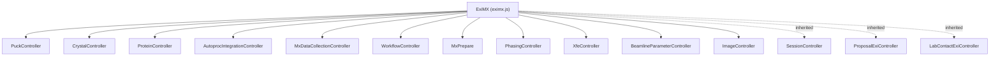

---

## 2. Navigation Menu

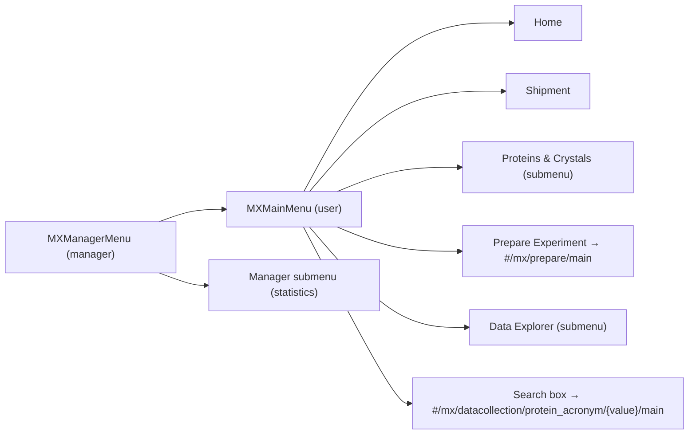

---

## 3. Routes Map

All hash-based routes and the controller that handles each.

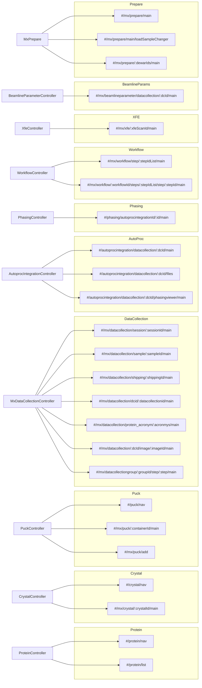

---

## 4. Data Collection — Widget Hierarchy & Endpoints

The most complex part of the MX module.

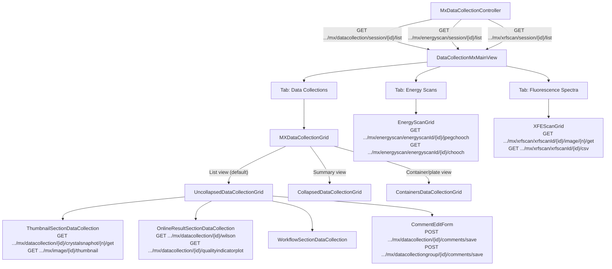

---

## 5. Autoprocessing — Widget Hierarchy & Endpoints

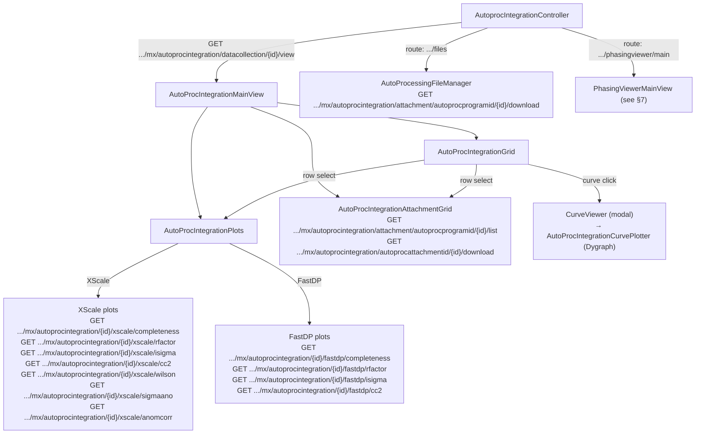

---

## 6. Protein & Crystal — Widget Hierarchy & Endpoints

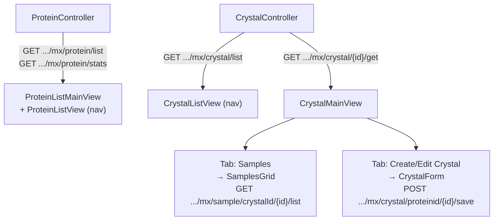

---

## 7. Phasing — Widget Hierarchy & Endpoints

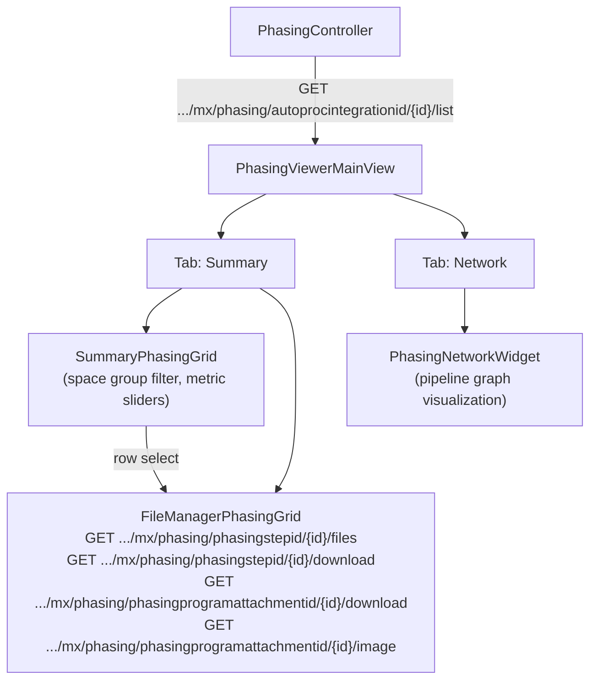

---

## 8. Workflow — Widget Hierarchy & Endpoints

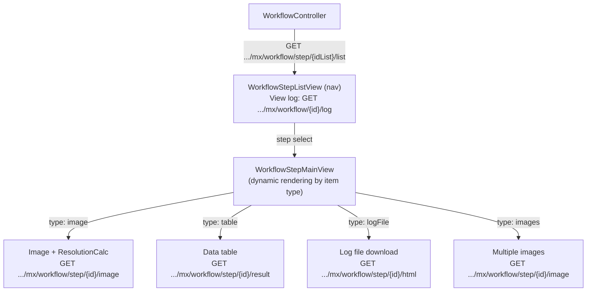

---

## 9. Sample Preparation (Wizard) — Widget Hierarchy & Endpoints

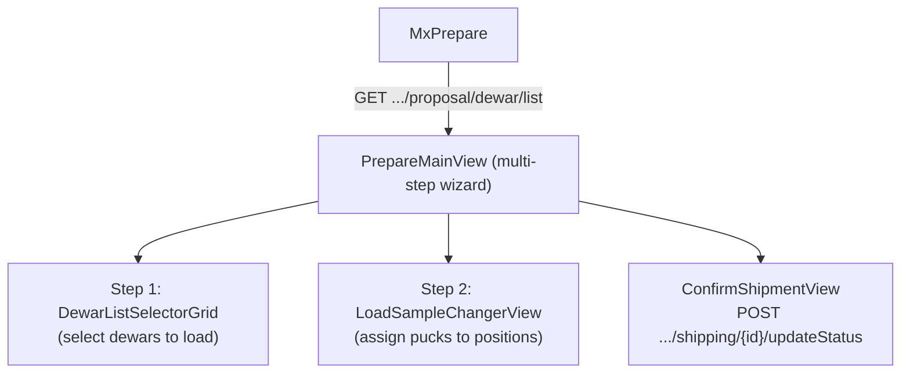

---

## 10. Puck / Sample Changer — Widget Hierarchy & Endpoints

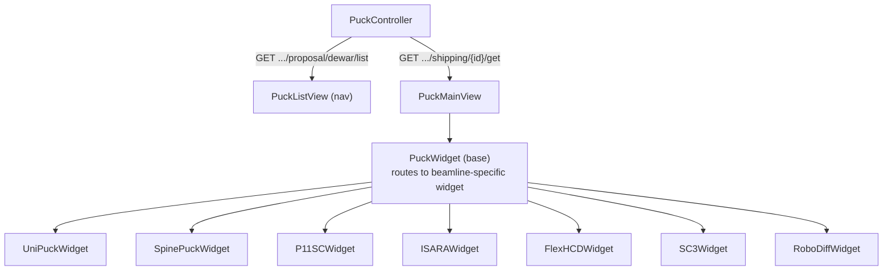

---

## 11. Ancillary Viewers

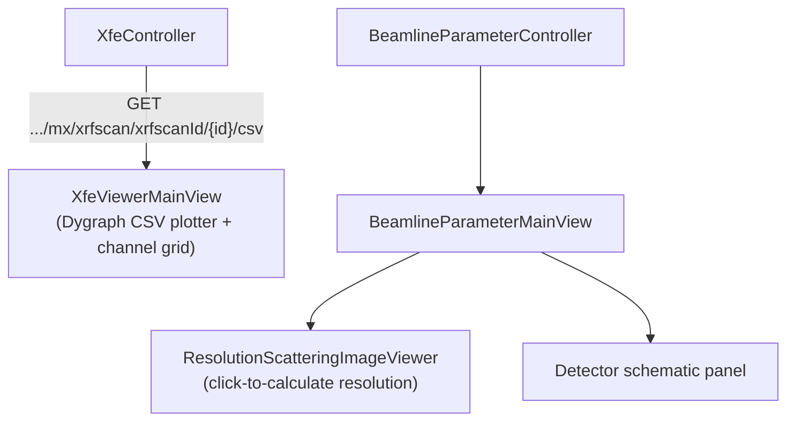

---

## 12. Complete ISPyB REST Endpoint Reference

| Adapter | Method | Endpoint |
|---|---|---|
| `mx.crystal` | list | `GET .../mx/crystal/list` |
| `mx.crystal` | get by id | `GET .../mx/crystal/{id}/get` |
| `mx.crystal` | list by protein | `GET .../mx/crystal/proteinid/{id}/list` |
| `mx.crystal` | list by geometry | `GET .../mx/crystal/geometryclass/{id}/list` |
| `mx.crystal` | save | `POST .../mx/crystal/proteinid/{id}/save` |
| `mx.protein` | list | `GET .../mx/protein/list` |
| `mx.protein` | stats | `GET .../mx/protein/stats` |
| `mx.protein` | save | `POST .../mx/protein/save` |
| `mx.sample` | by crystal | `GET .../mx/sample/crystalId/{id}/list` |
| `mx.sample` | full list | `GET .../mx/sample/list` |
| `mx.sample` | by dewar | `GET .../mx/sample/dewarid/{id}/list` |
| `mx.sample` | by container | `GET .../mx/sample/containerid/{id}/list` |
| `mx.sample` | by session | `GET .../mx/sample/sessionid/{id}/list` |
| `mx.sample` | by shipment | `GET .../mx/sample/shipmentid/{id}/list` |
| `mx.dataCollection` | by session | `GET .../mx/datacollection/session/{id}/list` |
| `mx.dataCollection` | by id | `GET .../mx/datacollection/{id}/list` |
| `mx.dataCollection` | by acronym | `GET .../mx/datacollection/protein_acronym/{list}/list` |
| `mx.dataCollection` | by sample | `GET .../mx/datacollection/sample/{id}/list` |
| `mx.dataCollection` | by shipping | `GET .../shipping/{id}/datacollections/list` |
| `mx.dataCollection` | by group | `GET .../mx/datacollection/datacollectiongroupid/{id}/list` |
| `mx.dataCollection` | save comments | `POST .../mx/datacollection/{id}/comments/save` |
| `mx.dataCollection` | wilson plot | `GET .../mx/datacollection/{id}/wilson` |
| `mx.dataCollection` | quality indicators | `GET .../mx/datacollection/{id}/qualityindicatorplot` |
| `mx.dataCollection` | crystal snapshot | `GET .../mx/datacollection/{id}/crystalsnaphot/{n}/get` |
| `mx.dataCollection` | image thumbnail | `GET .../mx/image/{id}/thumbnail` |
| `mx.dataCollection` | image full | `GET .../mx/image/{id}/get` |
| `mx.dataCollection` | PDF report | `GET .../mx/datacollection/session/{id}/report/pdf` |
| `mx.dataCollection` | RTF report | `GET .../mx/datacollection/session/{id}/report/rtf` |
| `mx.dataCollection` | analysis PDF | `GET .../mx/datacollection/session/{id}/analysisreport/pdf` |
| `mx.dataCollectionGroup` | save comments | `POST .../mx/datacollectiongroup/{id}/comments/save` |
| `mx.dataCollectionGroup` | xtal thumbnail | `GET .../mx/datacollectiongroup/{id}/xtal/thumbnail` |
| `mx.autoproc` | view by dc | `GET .../mx/autoprocintegration/datacollection/{id}/view` |
| `mx.autoproc` | list by dc | `GET .../mx/autoprocintegration/datacollection/{id}/list` |
| `mx.autoproc` | xscale completeness | `GET .../mx/autoprocintegration/{id}/xscale/completeness` |
| `mx.autoproc` | xscale rfactor | `GET .../mx/autoprocintegration/{id}/xscale/rfactor` |
| `mx.autoproc` | xscale isigma | `GET .../mx/autoprocintegration/{id}/xscale/isigma` |
| `mx.autoproc` | xscale cc2 | `GET .../mx/autoprocintegration/{id}/xscale/cc2` |
| `mx.autoproc` | xscale sigmaano | `GET .../mx/autoprocintegration/{id}/xscale/sigmaano` |
| `mx.autoproc` | xscale wilson | `GET .../mx/autoprocintegration/{id}/xscale/wilson` |
| `mx.autoproc` | xscale anomcorr | `GET .../mx/autoprocintegration/{id}/xscale/anomcorr` |
| `mx.autoproc` | fastdp completeness | `GET .../mx/autoprocintegration/{id}/fastdp/completeness` |
| `mx.autoproc` | fastdp rfactor | `GET .../mx/autoprocintegration/{id}/fastdp/rfactor` |
| `mx.autoproc` | fastdp isigma | `GET .../mx/autoprocintegration/{id}/fastdp/isigma` |
| `mx.autoproc` | fastdp cc2 | `GET .../mx/autoprocintegration/{id}/fastdp/cc2` |
| `mx.autoproc` | attachment list | `GET .../mx/autoprocintegration/attachment/autoprocprogramid/{id}/list` |
| `mx.autoproc` | attachment download | `GET .../mx/autoprocintegration/attachment/autoprocprogramid/{id}/download` |
| `mx.phasing` | by autoproc | `GET .../mx/phasing/autoprocintegrationid/{id}/list` |
| `mx.phasing` | by dc | `GET .../mx/phasing/datacollectionid/{id}/list` |
| `mx.phasing` | by sample | `GET .../mx/phasing/sampleid/{id}/list` |
| `mx.phasing` | by session | `GET .../mx/phasing/sessionid/{id}/list` |
| `mx.phasing` | step files | `GET .../mx/phasing/phasingstepid/{id}/files` |
| `mx.phasing` | step download | `GET .../mx/phasing/phasingstepid/{id}/download` |
| `mx.phasing` | attachment image | `GET .../mx/phasing/phasingprogramattachmentid/{id}/image` |
| `mx.phasing` | attachment download | `GET .../mx/phasing/phasingprogramattachmentid/{id}/download` |
| `mx.workflowstep` | list | `GET .../mx/workflow/step/{idList}/list` |
| `mx.workflowstep` | image | `GET .../mx/workflow/step/{id}/image` |
| `mx.workflowstep` | html | `GET .../mx/workflow/step/{id}/html` |
| `mx.workflowstep` | result | `GET .../mx/workflow/step/{id}/result` |
| `mx.workflow` | log | `GET .../mx/workflow/{id}/log` |
| `mx.energyscan` | by session | `GET .../mx/energyscan/session/{id}/list` |
| `mx.energyscan` | jpeg chooch | `GET .../mx/energyscan/energyscanId/{id}/jpegchooch` |
| `mx.energyscan` | chooch | `GET .../mx/energyscan/energyscanId/{id}/chooch` |
| `mx.energyscan` | scan file | `GET .../mx/energyscan/energyscanId/{id}/scanfile` |
| `mx.xfescan` | by session | `GET .../mx/xrfscan/session/{id}/list` |
| `mx.xfescan` | image | `GET .../mx/xrfscan/xrfscanId/{id}/image/{n}/get` |
| `mx.xfescan` | csv | `GET .../mx/xrfscan/xrfscanId/{id}/csv` |
| `proposal.dewar` | list | `GET .../proposal/dewar/list` |
| `proposal.shipping` | get container | `GET .../shipping/{id}/get` |
| `proposal.shipping` | update status | `POST .../shipping/{id}/updateStatus` |

> **Note:** All endpoints are prefixed with `/{token}/proposal/{proposal}/` unless otherwise shown.
> The `{token}` and `{proposal}` values are injected automatically by `EXI.getDataAdapter()`.

---

## 13. Shipping — Validation Logic & Constraints

The shipping module enforces sample validity at two points: **CSV bulk import** (`CSVPuckFormView`) and **single-puck edit** (`PuckFormView`). Both share the same uniqueness kernel (`PuckValidator`) but use different validation layers.

### 13.1 Constraint Summary

| Field | Rule | Applies to |
|---|---|---|
| Sample name | `^[a-zA-Z0-9_-]+$` — no spaces or special chars | CSV + puck |
| Protein name | same regex | CSV only |
| Protein + sample | unique across the **entire session** (all shipments) | CSV + puck |
| Protein + sample | unique **within the CSV being imported** | CSV only |
| Parcel / Dewar name | not already present in this shipment | CSV only |
| Container name | not already present in this shipment | CSV only |
| Container type | `Unipuck` or `SPINEpuck` (DESY/MAX IV: `Unipuck` only) | CSV only |
| Sample position | 1-based integer, ≤ container capacity (Unipuck: 16, SPINEpuck: 10) | CSV only |

### 13.2 `PuckValidator.checkSampleNames` — The Shared Uniqueness Kernel

`js/core/view/shipping/puckvalidator.js`

Called by both the CSV cell validator and `isDataValid`. Takes three arrays and returns the conflicting sample names.

```
Loop 1 — within-upload duplicates
  for each (name, proteinId) pair in the incoming CSV:
    if the same pair appears more than once → conflict

Loop 2 — against proposal
  for each incoming (name, proteinId):
    if found in proposalSamples { BLSample_name, Protein_proteinId } → conflict
```

`proposalSamples` is loaded asynchronously by `getSamplesFromProposal()` (see §13.4).

### 13.3 CSV Import — Two Validation Layers

`js/core/view/shipping/csvcontainerspreadsheet.js`

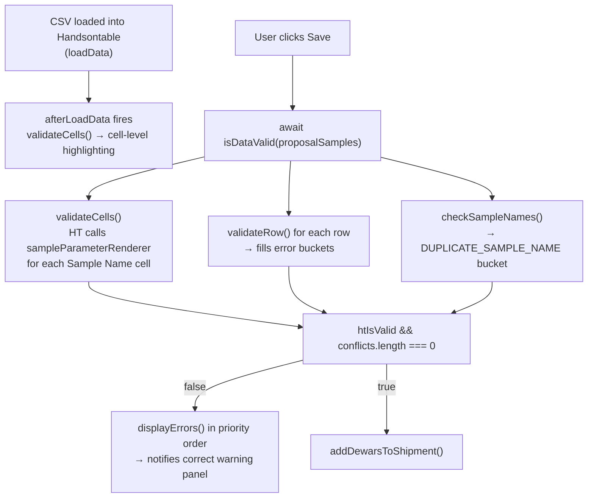

**Cell validator (`sampleParameterRenderer`)** — called by HT per cell, async callback:

```
if proposalSamples is empty:
    count protein+sample pairs across whole CSV
    callback(count ≤ 1)   ← valid if not a within-CSV duplicate
else:
    isSampleNameUniqueForProposal(value, protein, proposalSamples)
    callback(result)
```

**Error display priority** — `save()` short-circuits on the first non-empty bucket:

| Order | Error bucket | Panel text |
|---|---|---|
| 1 | `INCORRECT_PARCEL_NAME` | "Dewar Name should be unique for the whole shipment" |
| 2 | `INCORRECT_CONTAINER_NAME` | "Container Name should be unique for this shipment" |
| 3 | `INCORRECT_CONTAINER_TYPE` | "Accepted container types: SPINEpuck, Unipuck" |
| 4 | `INCORRECT_SAMPLE_POSITION` | "Protein + Sample Name should be unique…" ⚠ misplaced panel |
| 5 | `NO_PROTEIN_IN_DB` | "Protein should be added before importing" |
| 6 | `DUPLICATE_SAMPLE_NAME` | "Protein + Sample Name should be unique for the whole shipment" |
| 7 | `INCORRECT_SAMPLE_NAME` | "Sample Name should not contain special symbols" |
| 8 | `INCORRECT_PROTEIN_NAME` | "Protein should not contain special symbols" |

> ⚠ `INCORRECT_SAMPLE_POSITION` is routed to the uniqueness panel — pre-existing UI bug, no dedicated panel exists.

### 13.4 Proposal Samples — Async Loading

`PuckFormView.prototype.getSamplesFromProposal` (shared by CSV and single-puck views):

```
getAllShipmentIdsForSessionByShippingId(shippingId)
  └─ for each shipmentId (parallel via Promise.all):
       getSamplesByShipmentId(shipmentId)
  └─ flatten results → this.proposalSamples
```

Samples are fetched once on page load. For the uniqueness check to work correctly, `proposalSamples` must be fully loaded before `save()` is called. In Cypress tests this is enforced with `cy.wait('@getSamplesShipment2')` before clicking Save.

### 13.5 Single-Puck Edit — Lighter Validation

`js/core/view/shipping/a_puckformview.js` — `PuckFormView.prototype.save()`

No error buckets. Three sequential guards, each `return`s on failure:

```
1. Any sampleVO.name is empty/undefined
   → displaySpecialCharacterWarning("There are samples without a Sample Name")

2. checkSampleNames(names, proteinIds, proposalSamples)
   (existing samples from THIS container are first removed from proposalSamples
    to avoid false conflicts when re-saving an unchanged puck)
   → displayUniquenessWarning("Sample names are not unique for the session…")

3. Regex /[ ~`!@#$%^&*()+…]/ on each name
   → displaySpecialCharacterWarning("<name> contains special characters. Rows: #<n>")
```

---

## 14. Async Evolution — Promisification

### 14.1 Why `isDataValid` Had to Become Async

`Handsontable.validateCells(callback)` is genuinely asynchronous: it fans out to every registered column validator (each calls `callback(bool)` on its own schedule) and only fires its own callback after all validators have responded. There is no synchronous equivalent. Before this change, `isDataValid` returned a plain boolean and simply never waited for cell validation — the HT result was silently ignored.

### 14.2 Current Shape — Promise + `.then()`

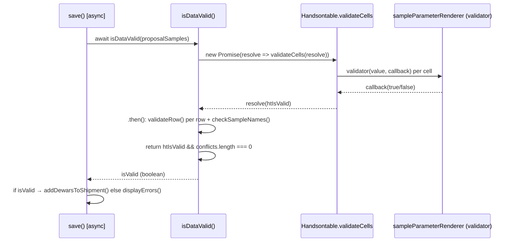

`save()` is declared `async` solely to use `await isDataValid(...)`. The ExtJS button handler (`function(){ _this.save(); }`) ignores the returned Promise — fire-and-forget, which is correct for UI event handlers.

> **Missing guard:** `save()` has no `try/catch` around the `await`. An unexpected rejection (e.g. HT throws during validation) silently aborts the save with no user feedback. A `try/catch` with `$.notify(...)` should be added.

### 14.3 Near-Term — `async/await` for `isDataValid`

The `.then()` chain in `isDataValid` is a direct candidate for flattening to `async/await`. The change is purely cosmetic but eliminates one nesting level:

```javascript
// Current
return new Promise(resolve => this.spreadSheet.validateCells(resolve))
  .then(htIsValid => {
      ...
      return isValid;
  });

// After
CSVContainerSpreadSheet.prototype.isDataValid = async function(sampleNamesProteinIds) {
    this.errors = this.resetErrors();
    const htIsValid = await new Promise(resolve =>
        this.spreadSheet.validateCells(resolve)
    );
    ...           // flat, linear logic
    return isValid;
};
```

Zero behaviour change. `getSamplesFromProposal` is already written with `Promise.all` — consistent style.

### 14.4 Future — Full `async/await` via Data Adapter Promisification

Every ISPyB REST call uses the same callback pattern:

```javascript
EXI.getDataAdapter({ onSuccess: fn, onError: fn })
   .proposal.shipping.getShipment(shippingId);
```

`DataAdapter.prototype.get(url)` fires an XHR and resolves by calling `this.onSuccess(sender, data)` or `this.onError(sender, error)`. The entire app uses this pattern, making a central Promisification the high-leverage path:

```javascript
// One new method on DataAdapter (or a thin wrapper factory)
DataAdapter.prototype.request = function() {
    return new Promise((resolve, reject) => {
        this.onSuccess = (sender, data) => resolve(data);
        this.onError  = (sender, error) => reject(error);
    });
};

// Call site becomes:
const shipment = await EXI.getDataAdapter()
    .proposal.shipping.getShipment(shippingId)
    .request();
```

Once the adapter layer is Promisified, the full save/load flow collapses from deeply-nested callbacks into linear `async/await` — eliminating the closure-heavy `onSuccess`/`onError` pattern throughout the codebase. This is a **separate PR** with its own test coverage requirements given the blast radius across all modules.

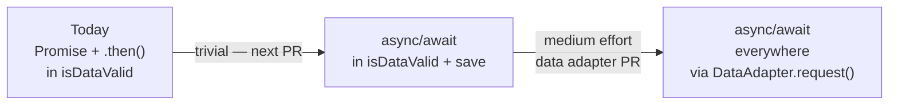

---

## Testing Priority

Based on usage frequency and user impact, suggested order for writing Cypress tests:

| Priority | Widget/Route | Key Endpoints to Mock |
|---|---|---|
| P0 | `DataCollectionMxMainView` — session view | `datacollection/session/{id}/list` |
| P0 | `AutoProcIntegrationMainView` | `autoprocintegration/datacollection/{id}/view` |
| P1 | `ProteinListMainView` | `protein/list`, `protein/stats` |
| P1 | `CrystalMainView` + `SamplesGrid` | `crystal/{id}/get`, `sample/crystalId/{id}/list` |
| P1 | `PhasingViewerMainView` | `phasing/autoprocintegrationid/{id}/list` |
| P2 | `WorkflowStepMainView` | `workflow/step/{id}/list` |
| P2 | `EnergyScanGrid` + `XFEScanGrid` | `energyscan/session/{id}/list`, `xrfscan/session/{id}/list` |
| P3 | `PrepareMainView` (wizard) | `proposal/dewar/list` |
| P3 | `PuckMainView` / sample changer widgets | `shipping/{id}/get` |
