# User Journeys

Where the [User Guide](user-guide.md) explains how to accomplish a task and
[MX Module Architecture](architecture.md) explains how the system is built, this document
explains what actually happens, screen by screen and request by request, when each of EXI's
three personas uses the app. Every journey below was walked to completion against a live,
running instance — not inferred from source alone — and each carries a validation badge saying
how thoroughly.

Built from the Path.js route table across every MX/core controller, both menu classes
(`MXMainMenu`/`MXManagerMenu`), every REST adapter's URL templates, and cross-checked against the
User Guide and Architecture doc.

---

## How to read this document

- **Journey IDs** are `<Persona letter><number>`, e.g. `A2`. Sub-branches use a trailing letter (`A5a`).
- **Validation** status per journey:
  - `✅ live-verified` — walked to completion in a real browser, including any write, against a
    running instance of the app.
  - `⚠️ partial — <reason>` — some steps verified, others not (e.g. a write step skipped).
  - `📄 static-only — <reason>` — derived from source/menu/docs only, not yet run live.
- Every journey step table has 4 columns: **User action**, **Route** (hash fragment after the
  navigation, or "—" for in-page dialogs), **View class** (ExtJS view constructed), **REST calls
  fired** (adapter method → URL template, from `js/ispyb-client/`).
- "REST calls fired" uses the URL templates from the data-adapter source
  (`{token}`/`{proposal}` are runtime-substituted, `{0}`/`{1}`/… are positional args).
- Routing is via **Path.js** (`Path.map(...).to(...)`), not `Ext.util.History`/hasher/crossroads.
  Matching is first-match over insertion order in `Path.routes.defined`; identical pattern strings
  overwrite. See "Cross-cutting journeys" for the ordering hazards this creates.

### Environment used for validation

| Fact | Value |
|---|---|
| EXI app | `http://localhost:8080/exi/mx/index.html` |
| ISPyB REST | `http://localhost:8080/ispyb/ispyb-ws/rest` (same origin as the app — no CORS) |
| DB | MariaDB in Docker, seeded via the project's test-data seeder |
| Login — User | `usr01` / seed-data account, "U. User (Roga & Kopyta Ltd)" |
| Login — Manager | `mgr01` / seed-data account, "M. Manager (Roga & Kopyta Ltd)" |
| DB scale | Production-scale dump — 739 BLSession, 29 530 DataCollection, 9 446 AutoProcIntegration,
  274 Shipping, 460 Protein, 1 812 Crystal, 204 LabContact. `Phasing`, `EnergyScan`,
  `XFEFluorescenceSpectrum` are empty; `Ligand` table does not exist. |
| Attachment files | Attachment rows in the dump reference beamline data paths
  (`/data/beamline/p11/...`) that don't exist on a dev machine — autoprocessing plot/attachment
  requests 404 against unmodified dump data. Worked around for one data collection by pointing
  two attachment rows at a real fixture file — see B4 for what it confirmed. |

---

## Persona model

Three personas, distinguished by the toolbar ExtJS constructs (`js/mx/eximx.js`) and by
role-gating inside `js/core/menu/mainmenu.js`:

| Persona | Toolbar | Constructed from | Gating |
|---|---|---|---|
| **A — External User** (PI / sample submitter) | `MXMainMenu` (`js/mx/menu/mxmainmenu.js`) | any credential without Manager role | `Shipment` and `Proteins and Crystals` menus are enabled only when `EXI.credentialManager.hasActiveProposal()`; **Add new Protein** additionally requires `isUserAllowedAddProtein()` against `allow_add_proteins_roles` in the credential's `properties` |
| **B — Local Contact / Beamline Scientist** | Same `MXMainMenu`, or `MXManagerMenu` if their role qualifies | overlaps with Manager in practice — ISPyB does not have a distinct "local contact" role in this deployment's property file | reaches the same routes as A once a proposal is active, plus the post-experiment/beamline-side views (data collections, autoproc, workflow, prepare) which are drill-down-only (no menu entry) |
| **C — Facility Manager** | `MXManagerMenu` (`js/mx/menu/mxmanagermenu.js`) = `MXMainMenu` + **Manager ▸ Statistics** | credential role `Manager` | sees all proposals via date-range / per-proposal search on the welcome page; unrestricted `hasActiveProposal()` because they can select any proposal |

A logged-out or no-active-proposal user can only reach **Home/Sessions/Proposals**, **About**, and
**Sign In** — every other menu item is disabled by the `beforeshow` gates above.

---

## Journey map

Grouped by persona, coloured by how thoroughly each has been validated against a live instance.

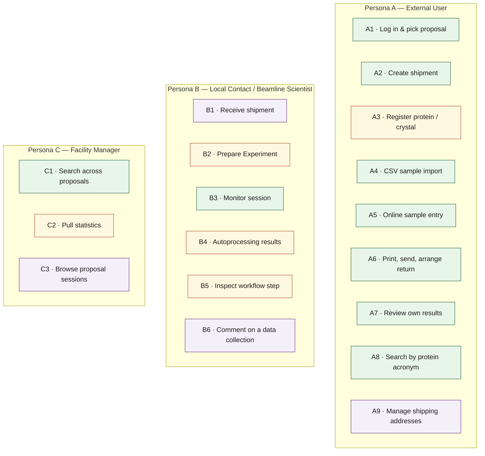

<span class="swatch" style="background:#2d6a44"></span> live-verified &nbsp;
<span class="swatch" style="background:#b0502f"></span> partial &nbsp;
<span class="swatch" style="background:#6b3585"></span> static-only

---

## Journey index

| ID | Persona | Journey | Entry point | Validation |
|---|---|---|---|---|
| A1 | A | Log in, choose a period, select a proposal | `#/welcome` → `#/welcome/user/{user}/main` | ✅ |
| A2 | A | Create a shipment | Shipment ▸ Shipments ▸ Add new | ✅ |
| A3 | A | Register a protein / crystal | Proteins and Crystals ▸ Add new / List | ⚠️ partial — protein creation verified; crystal-form save not exercised |
| A4 | A | Fill sample list via CSV import | shipment card ▸ Import from CSV | ✅ |
| A5 | A | Fill sample list online (parcel→container→puck) | shipment card ▸ Add parcel | ✅ (bug found — see notes) |
| A6 | A | Print labels, send shipment, arrange return | shipment card ▸ Print labels / Send Shipment | ✅ fully confirmed end-to-end |
| A7 | A | Review my own results after beamtime | Data Explorer ▸ Calendar → session | ✅ |
| A8 | A | Find data collections by protein acronym | menu-bar search box | ✅ |
| A9 | A | Manage shipping/lab-contact addresses | Shipment ▸ Manage shipping addresses ▸ List | 📄 static-only |
| B1 | B | Receive shipment, mark it at facility / to user | shipment detail status transitions | 📄 static-only — not independently re-tested |
| B2 | B | Prepare Experiment — load sample changer | Prepare Experiment (menu) | ⚠️ partial — drag-to-position and confirm/unload not exercised |
| B3 | B | Monitor a session's data collections, switch card tabs | DC session view | ✅ |
| B4 | B | Drill into autoprocessing results (plots), download attachments | DC card "Last Collect Results" tab / `#/autoprocintegration/...` | ⚠️ plot rendering fully confirmed with real data; Files/download and phasing-viewer are **broken** and out of scope |
| B5 | B | Inspect a workflow / characterisation step | DC card Workflow tab (per-card, when enabled) | ⚠️ partial — **primary route is broken** |
| B6 | B | Annotate a data collection with a comment | DC card ▸ comment icon | 📄 static-only |
| C1 | C | Search sessions across all proposals by date | Home/Sessions ▸ "Choose a period of time" | ✅ |
| C2 | C | Pull statistics as CSV | Manager ▸ Statistics | ⚠️ dialog verified; CSV download itself not triggered |
| C3 | C | Browse all sessions for one proposal | (linked from DC view "all sessions for proposal") | 📄 static-only |
| X1 | — | Switch active proposal mid-session | credential splitbutton | ⚠️ partial — exercised programmatically, not via the splitbutton UI |
| X2 | — | Deep link into a specific DC/session/shipment pre-auth | `#/mx/proposal/{p}/datacollection/session/{id}/main` etc. | 📄 static-only |
| X3 | — | Log out | Sign In/Log out splitbutton ▸ Log out | ⚠️ partial — discovered that **`#/welcome` itself also logs out**, not just `#/logout` |
| X4 | — | Failed login | auth form, wrong credentials | ✅ |

---

## Persona A — External User (PI / sample submitter)

### A1 — Log in, choose a period, select a proposal

**Trigger:** navigate to the app with no session, or Home/Sessions/Proposals menu item.
**Validation:** ✅ live-verified, both roles (`usr01`/User, `mgr01`/Manager)
**User guide:** [§Logging to EXI](user-guide.md#logging-to-exi)

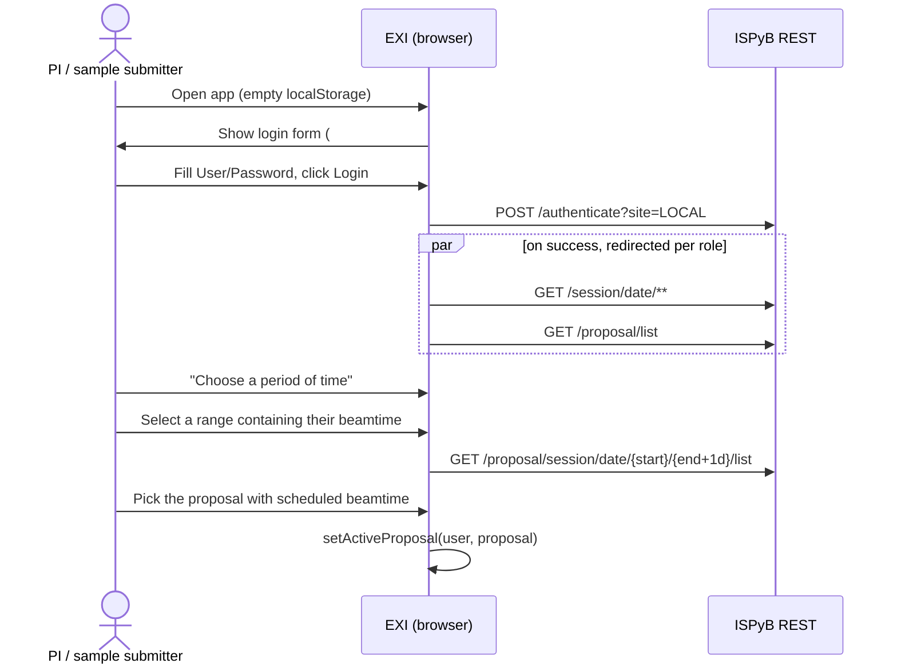

| # | User action | Route | View class | REST calls fired |
|---|---|---|---|---|
| 1 | Loads app with empty `localStorage` | `#/` → `#/welcome` | `AuthenticationForm` (modal) | — |
| 2 | Fills User/Password, clicks Login | — | `AuthenticationForm` | `POST /authenticate?site=LOCAL` |
| 3 | On success, redirected per role | `#/welcome/user/{user}/main` (User) or `#/welcome/manager/{user}/main` (Manager) | `ManagerWelcomeMainView` / `WelcomeMainView` | `GET /session/date/**`, `GET /proposal/list` (parallel, `loadSessionsByDate`) |
| 4 | Clicks "Choose a period of time" | — (Bootstrap modal, not ExtJS window) | `DateRangePicker` | — |
| 5 | Selects a range containing their beamtime | `#/welcome/manager/{user}/date/{start}/{end}/main` | `ManagerWelcomeMainView` | `GET /proposal/session/date/{start}/{end+1d}/list` |
| 6 | Picks the proposal with scheduled beamtime from the session grid | sets `EXI.credentialManager.setActiveProposal(user, proposal)` client-side | — | (subsequent requests carry `{proposal}`) |

**Notes:** `loadByDate` adds 1 day to the end date before querying. The "Home" menu label is
site-dependent — some deployments render it "Sessions"; the User Guide's instruction to "Click on
Sessions" only matches that rendering.

**Live findings:**
- Fresh login for a User-role account returns `activeProposals: [<username>]` — the server
  defaults the active proposal to the **username itself**, not a real proposal code, when the
  user has no default. The client then fires `GET /proposal/{username}/info/get` → `401`. This is
  expected/benign (matches the documented "no active proposal" gating) but worth knowing: step 6
  (picking a real proposal) is not optional even for a returning user — the server-provided
  default is never a valid proposal.
- `MXMainMenu` (User) renders: Home, Shipment, Proteins and Crystals (NEW), Prepare Experiment, Data
  Explorer, About, acronym search, Log out. `MXManagerMenu` (Manager) is identical **plus a "Manager"
  top-level item** (▸ Statistics). Confirms the Persona A/C toolbar split exactly as documented.
- Setting `setActiveProposal()` while already on a route with the *same* hash does **not** re-fire
  the route (Path.js only dispatches on hash change) — confirmed by testing; a real user always
  changes route immediately after picking a proposal, so this is not user-visible, only a testing
  gotcha (see X1).

---

### A2 — Create a shipment

**Trigger:** Shipment ▸ Shipments ▸ Add new (menu; gated on `hasActiveProposal()`)
**Validation:** ✅ live-verified as User role with an active proposal
**User guide:** [§Create a Shipment](user-guide.md#create-a-shipment)

```mermaid
sequenceDiagram
    actor U as PI / sample submitter
    participant EXI as EXI (browser)
    participant API as ISPyB REST
    U->>EXI: Shipment ▸ Shipments ▸ Add new
    EXI->>API: GET /shipping/labcontact/list
    EXI->>API: GET /{proposal}/session/list
    U->>EXI: Fill Name, Session, From; leave Return as default; Save
    EXI->>API: POST /shipping/save
    API-->>EXI: shippingId
    EXI->>EXI: route → #/shipping/{id}/main
    EXI->>API: GET /shipping/{id}/get
```

| # | User action | Route | View class | REST calls fired |
|---|---|---|---|---|
| 1 | Opens Shipment ▸ Add new (menu ▸ Shipment ▸ Shipments ▸ Add new) | modal, no route | `ShipmentEditForm` (`js/core/view/shipping/shipmenteditform.js`) | `GET /shipping/labcontact/list`, `GET /{proposal}/session/list` |
| 2 | Fills Name (must be proposal-unique), selects Session, From contact, leaves Return as default | — | `ShipmentEditForm` | — |
| 3 | Clicks Save | → `#/shipping/{shippingId}/main` | `ShippingMainView` | `POST /shipping/save`, then `GET /shipping/{shippingId}/get` |

**Failure/edge paths:** duplicate shipment name (server-side uniqueness); no active proposal (menu
item disabled before this point).

**Live findings:** ExtJS submenus (Shipment ▸ Shipments) only populate on a real `mouseover` event —
a plain `.click()` on the parent menu item does not reveal the flyout; needs an actual hover. The
"Create New Shipment" dialog pre-fills From with the user's own lab contact and defaults Return to
"Same as for shipping to beamline", exactly as the User Guide describes.

---

### A3 — Register a protein / crystal

**Trigger:** Proteins and Crystals ▸ Add new Protein / List
**Validation:** ⚠️ partial — protein creation live-verified; crystal-form save not exercised
**User guide:** [§Adding New Protein and Creating New Sample](user-guide.md#adding-new-protein-and-creating-new-sample)

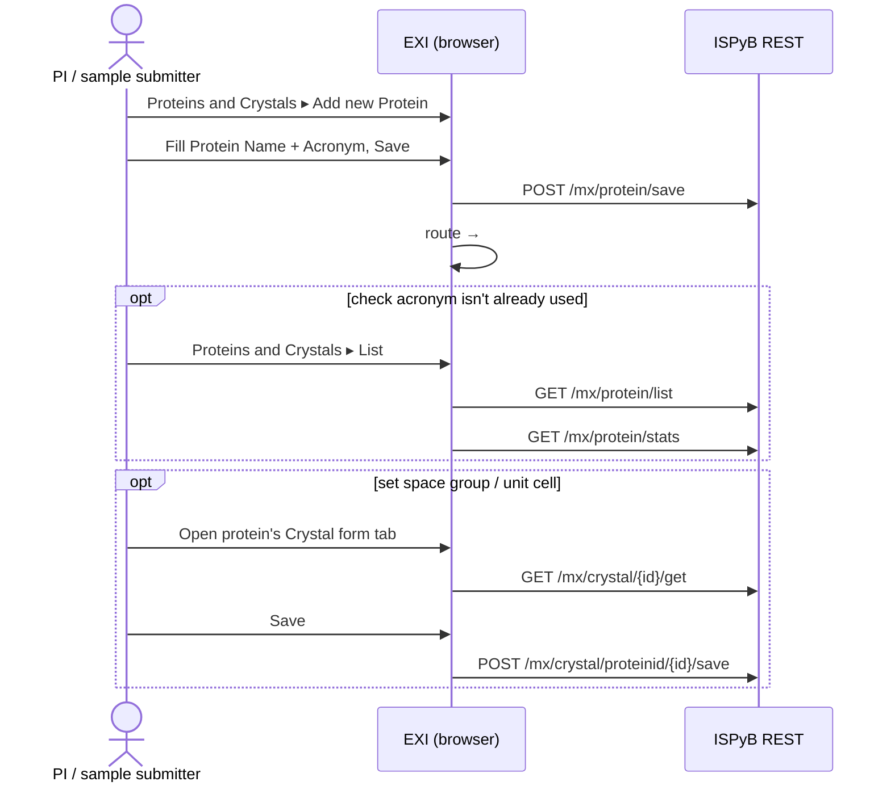

| # | User action | Route | View class | REST calls fired |
|---|---|---|---|---|
| 1 | Proteins and Crystals ▸ Add new Protein | modal, no route | `ProteinEditForm` (`js/core/widget/proteineditform.js`) | — |
| 2 | Fills Protein Name + Acronym, Save | on save → `#/protein/list` | `ProteinListMainView` | `POST /mx/protein/save` |
| 3 | Alternatively: Proteins and Crystals ▸ List, checks acronym isn't already used | `#/protein/list` | `ProteinListMainView` | `GET /mx/protein/list`, `GET /mx/protein/stats` |
| 4 | Optionally sets space group / unit cell via the Crystal form tab on the protein's card | `#/mx/crystal/{crystalId}/main` | `CrystalMainView` | `GET /mx/crystal/{id}/get`, `POST /mx/crystal/proteinid/{id}/save` |

**Gating — confirmed live:** a User-role account (no Manager role) has `isUserAllowedAddProtein()
=== true` and the "Add new Protein" menu item is enabled. `allow_add_proteins_roles:
["user","manager"]` in this deployment's credential properties, so **A3 correctly belongs to
Persona A**, not B/C — plain users are meant to add proteins per the User Guide's own
instructions.

**Live findings:** after a successful `POST /mx/protein/save`, the currently-open `#/protein/list`
page does **not** refresh its count — confirms the User Guide's own instruction ("Refresh the page
to show the newly created protein") is not a suggestion but a required workaround for a real
staleness bug (the view is not re-fetched after save).

---

### A4 — Fill sample list via CSV import

**Trigger:** shipment detail page ▸ "Import from CSV" link on a parcel
**Validation:** ✅ live-verified — both the validation-blocking path and the happy path
**User guide:** [§Fill Sample Information in a CSV File](user-guide.md#fill-sample-information-in-a-csv-file)

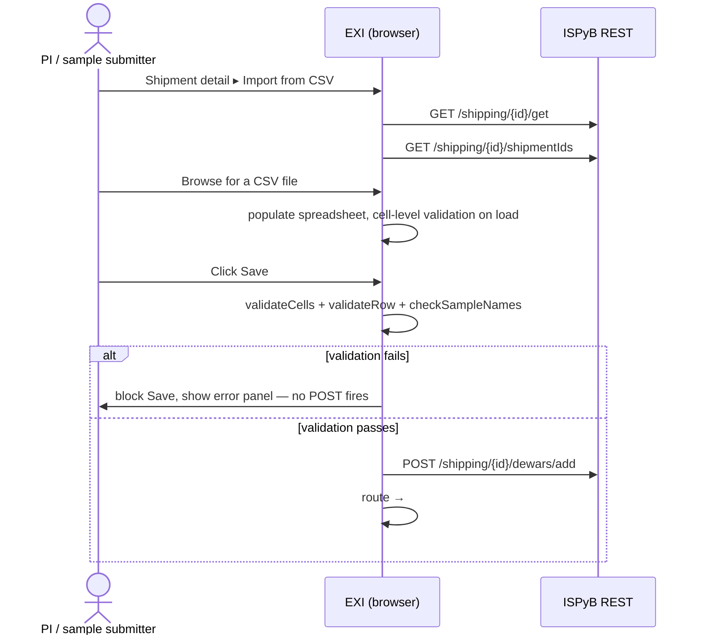

| # | User action | Route | View class | REST calls fired |
|---|---|---|---|---|
| 1 | On shipment detail, clicks Import from CSV | `#/shipping/{id}/import/csv` | `CSVPuckFormView` | `GET /shipping/{id}/get`, `GET /shipping/{id}/shipmentIds` |
| 2 | Browses for a CSV file (e.g. `documentation/Shipment.csv`) | — | `CSVContainerSpreadSheet` | — |
| 3 | Spreadsheet populates; two validation layers run (cell highlight on load, full `validateCells` + `validateRow` + `checkSampleNames` on Save) | — | `PuckValidator` | — |
| 4 | Clicks Save with valid data | redirects to `#/shipping/{id}/main` | — | `POST /shipping/{id}/dewars/add` |

**Already covered** by the existing `cypress/e2e/shipping/csv-upload.cy.js`. See
[Testing & Quality](testing.md) for current spec coverage.

**Known app bug:** `CSVContainerSpreadSheet.prototype.loadData` captures the same array both as
the Handsontable data source and in an `afterCreateRow` closure that splices from it in place —
the array empties itself, so naive re-validation sees nothing.

**Failure/edge paths:** sample name special characters, unknown protein acronym, duplicate
dewar/container name in shipment, unrecognised container type, over-capacity position,
duplicate protein+sample pair in the CSV, protein+sample uniqueness against the whole session.

**Live findings:**
- Uploading a CSV referencing a protein acronym that does not exist in the DB correctly parsed
  the rows into the spreadsheet, then **blocked Save** — no `POST /shipping/{id}/dewars/add`
  fired, confirming the unknown-protein validation path works end-to-end against a real,
  non-mocked proposal.
- A second CSV using a real, existing acronym (created in A3) saved successfully.
- `GET /{proposal}/info/get` (listed as firing on this route in the original static pass) was
  **not** observed firing for the CSV import page — only `shipping/{id}/get` and
  `shipping/{id}/shipmentIds`.

---

### A5 — Fill sample list online (parcel → container → puck)

**Trigger:** shipment detail page ▸ "Add parcel" button
**Validation:** ✅ live-verified, steps 1–6 and 8 (step 7 inline Add-Protein not
independently re-tested — mechanically identical to A3, already confirmed there)
**User guide:** [§Fill Sample Information Online](user-guide.md#fill-sample-information-online)

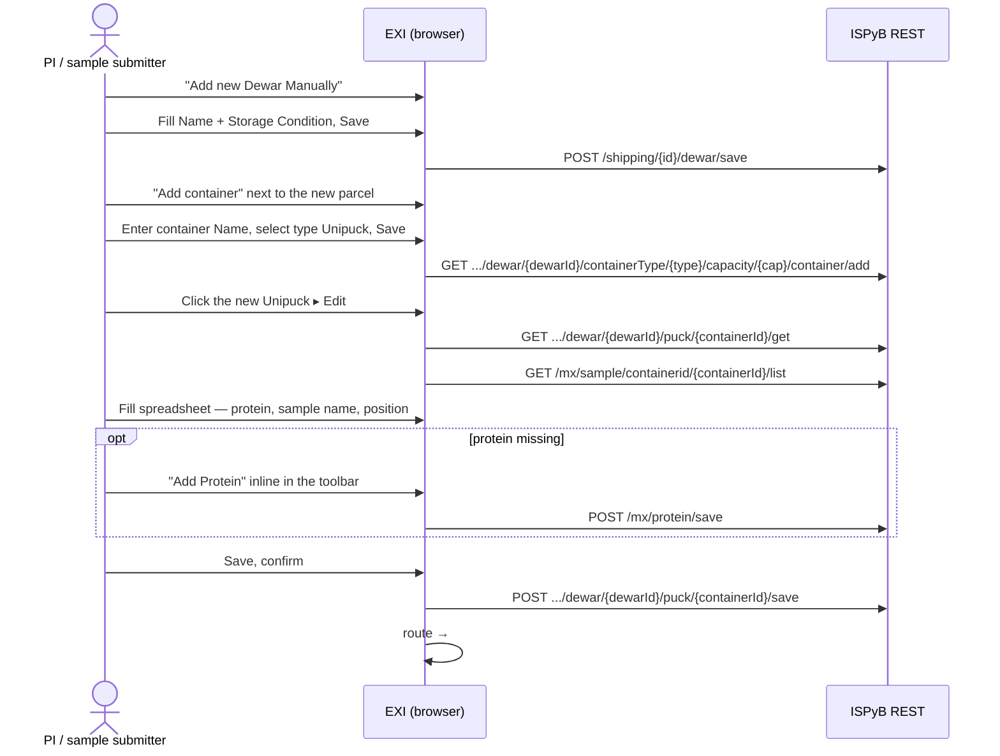

| # | User action | Route | View class | REST calls fired |
|---|---|---|---|---|
| 1 | Clicks "Add new Dewar Manually" (rendered label for "Add parcel") | dialog, no route | `ParcelPanel` / "New Dewar" form | — |
| 2 | Fills Name (shipment-unique) + Storage Condition, Save | reloads shipment | `ShippingMainView` | `POST /shipping/{id}/dewar/save` |
| 3 | Clicks "Add container" next to the new parcel | dialog ("Container") | `AddContainerForm` | — |
| 4 | Enters container Name (engraved on Unipuck, shipment-unique), selects type Unipuck, Save | reloads shipment | — | `GET /shipping/{id}/dewar/{dewarId}/containerType/{type}/capacity/{cap}/container/add` |
| 5 | Clicks the new Unipuck, selects Edit | `#/shipping/{id}/{status}/containerId/{containerId}/edit` | `PuckFormView` (`a_puckformview.js`) | `GET /shipping/{id}/dewar/{dewarId}/puck/{containerId}/get` — **see bug below**, `GET /mx/sample/containerid/{containerId}/list` |
| 6 | Fills the spreadsheet: protein dropdown, sample name (session+CSV unique), position | — | `ContainerSpreadSheet` | — |
| 7 | If protein missing, clicks "Add Protein" inline in the toolbar | — | `ProteinEditForm` (same as A3) | `POST /mx/protein/save`; page refresh needed to see it in the dropdown |
| 8 | Clicks Save, confirms | redirects to `#/shipping/{id}/main` | — | `POST /shipping/{id}/dewar/{dewarId}/puck/{containerId}/save` — **see bug below** |

**Already covered** by `cypress/e2e/shipping/puck-form.cy.js` for the puck-edit step — the parcel
and container creation steps (1–4) had no Cypress coverage before this catalogue was built.

**🐛 Confirmed bug — wrong positional arguments in `getContainerById`/`saveContainer` calls.**
`js/core/view/shipping/a_puckformview.js:73` calls
`getContainerById(this.containerId, this.containerId, this.containerId)` instead of
`(this.shippingId, this.dewarId, this.containerId)`. `ShippingDataAdapter.getContainerById(shippingId,
dewarId, containerId)` builds `/shipping/{0}/dewar/{1}/puck/{2}/get` — so the request that
actually fires uses the container id in all three positions instead of the correct
shipping/dewar/container triple:
```
GET .../shipping/{containerId}/dewar/{containerId}/puck/{containerId}/get   (should be .../shipping/{shippingId}/dewar/{dewarId}/puck/{containerId}/get)
POST .../shipping/{containerId}/dewar/{containerId}/puck/{containerId}/save  (same mismatch on Save)
```
Both calls returned `200` and correctly loaded/saved the real data anyway — the ISPyB REST server
apparently resolves the puck purely by the container-id path segment and ignores the (wrong)
shipping/dewar segments. **The journey still completes successfully for the user**, but every puck
edit in the app requests/saves against a semantically wrong URL. This is a real defect worth fixing
regardless of the fact that it happens not to break anything today.

**Failure/edge paths:** empty sample name, special characters, duplicate protein+sample within
container, duplicate protein+sample already existing in the proposal, Save disabled once the
container has data-collected samples.

---

### A6 — Print labels, send shipment, arrange return

**Trigger:** shipment detail page ▸ Print labels icon / Send Shipment button
**Validation:** ✅ live-verified, all of steps 1–3 confirmed end-to-end (offline steps 4–6 out of
scope for live testing)
**User guide:** [§Send the Shipment to DESY](user-guide.md#send-the-shipment-to-desy),
[§Arrange the Return of Dewars](user-guide.md#arrange-the-return-of-dewars)

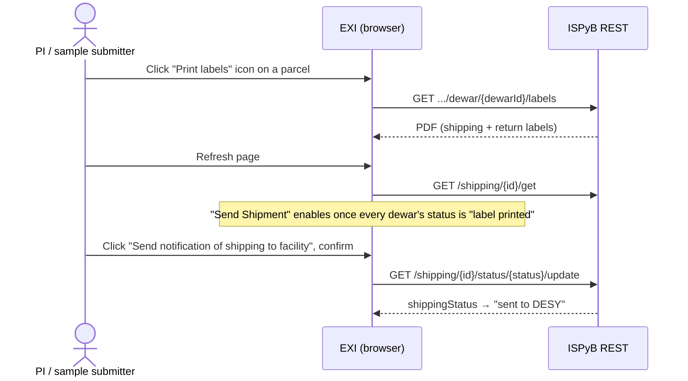

| # | User action | Route | View class | REST calls fired |
|---|---|---|---|---|
| 1 | Clicks "Print labels" icon on a parcel | — | — | `GET /shipping/{id}/dewar/{dewarId}/labels` (PDF) — **see id-mismatch note below** |
| 2 | Refreshes page — "Send Shipment" becomes enabled once every dewar's status is "label printed" | `#/shipping/{id}/main` | `ShippingMainView` | `GET /shipping/{id}/get` |
| 3 | Clicks "Send notification of shipping to facility" (rendered label for "Send Shipment"), confirms | — | ExtJS `Ext.Msg` info dialog | `GET /shipping/{id}/status/{status}/update` (status → "sent to DESY") |
| 4 | (Offline) Attaches physical labels, ships dewar | — | — | — |
| 5 | Local contact marks arrival (see B1) | — | — | `GET /shipping/{id}/status/{status}/update` (→ "Mark shipment at facility" then "Send shipment to the user") |
| 6 | (Offline, post-collection) Attaches return papers, places dewar at departure point | — | — | — |

**Gating — confirmed correct and working:** the button is hidden entirely once `shippingStatus` is
`"sent to DESY"`/`"Sent_to_DESY"`/`"at DESY"`/`"at LOCAL"`; disabled unless every dewar has
`dewarStatus === "label printed"`; and the click handler additionally guards on
`shippingStatus === "opened"` before firing the status update
(`js/core/view/shipping/shipmentform.js:150-227`). Confirmed live: printed both dewar labels,
reloaded, button was enabled, clicked it, the status-update call returned `200`, and the DB
confirmed `shippingStatus` transitioned to `"sent to DESY"`.

**🐛 Confirmed bug, minor — wrong positional arguments in `getDewarLabelURL`.**
`js/core/widget/parcelpanel.js:108` calls
`EXI.getDataAdapter().proposal.shipping.getDewarLabelURL(dewarId, dewarId)` — both arguments are
the dewar id, so the request is `.../shipping/{dewarId}/dewar/{dewarId}/labels` instead of
`.../shipping/{shippingId}/dewar/{dewarId}/labels`. The equivalent SAXS call site
(`js/saxs/widget/casegrid.js:510`) passes the arguments correctly — this is the MX-side call
that's wrong. The server tolerates the wrong shippingId and serves the PDF anyway (confirmed via
DB: the dewar ended up with `dewarStatus = 'label printed'` after printing), so **step 1
completes successfully for the user** despite the wrong URL.

**Minor, likely environmental:** clicking Send also fires `POST /send` (email notification),
which returned `500` on this dev instance — almost certainly no mail server configured there, not
an app defect.

---

### A7 — Review my own results after beamtime

**Trigger:** Data Explorer ▸ Calendar, drilling into a session row
**Validation:** ✅ live-verified — reached directly by hash (session-grid click itself not
exercised; identical mechanism to A1/C1's session grid)

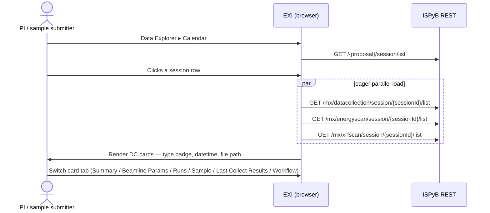

| # | User action | Route | View class | REST calls fired |
|---|---|---|---|---|
| 1 | Data Explorer ▸ Calendar | `#/session/nav` | `SessionMainView` | `GET /{proposal}/session/list` (or date-filtered) |
| 2 | Clicks a session row | `#/mx/datacollection/session/{sessionId}/main` | `DataCollectionMxMainView` | `GET /mx/datacollection/session/{sessionId}/list`, **and eagerly, in parallel:** `GET /mx/energyscan/session/{sessionId}/list`, `GET /mx/xrfscan/session/{sessionId}/list` |
| 3 | Reviews DC cards — type badge, datetime, file path | — | `MXDataCollectionGrid` (Uncollapsed/Collapsed/Containers modes) | — |
| 4 | Switches Bootstrap tabs per card: Summary / Beamline Parameters / Data Collections (runs) / Sample / **Last Collect Results** / Workflow | anchor hrefs, not routes (`.nav-tabs a`) | per-section widgets | see B4 for the results tab's endpoint |
| 5 | Checks main-panel top tabs: "N Data Collections" (active), Energy Scans / Fluorescence Spectra (disabled if session has none) | — | `a.x-tab` elements | — |

**Corrections found live:**
- The energy-scan and XRF-scan lists are fetched **eagerly on page load**, not deferred to a tab
  click — all three list calls fire together.
- The per-card tab list has **6 tabs, not 5** — the original static pass missed **"Last Collect
  Results"** (badge shows a count, e.g. "5"). This tab, not "Workflow", is where autoprocessing
  results render. "Workflow" is a real, separate tab that is `disabled` per-card whenever that
  specific data collection has no associated `Workflow` record (most DCs don't — only 5
  `Workflow` rows exist in this DB against 29 530 `DataCollection` rows).
- Confirmed exact main-panel tab count for a session with 334 data collections matches the DB
  count exactly. `Energy Scans` and `Fluorescence Spectra` both carry `x-tab-disabled`.

---

### A8 — Find data collections by protein acronym

**Trigger:** menu-bar search box, "search by protein acronym"
**Validation:** ✅ live-verified

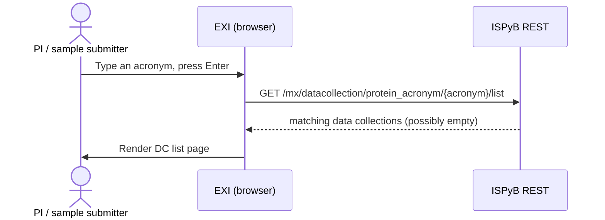

| # | User action | Route | View class | REST calls fired |
|---|---|---|---|---|
| 1 | Types an acronym, presses Enter | `#/mx/datacollection/protein_acronym/{acronym}/main` | `DataCollectionMxMainView` | `GET /mx/datacollection/protein_acronym/{acronym}/list` |

**Live findings:** searching for a freshly-created acronym with 0 data collections correctly
returned `200` with an empty result and rendered the empty DC-list page — no error, no dead end.

---

### A9 — Manage shipping / lab-contact addresses

**Trigger:** Shipment ▸ Manage shipping addresses ▸ List
**Validation:** 📄 static-only — not exercised live
**User guide:** the "Edit Shipment and Creating a Lab Contact" heading is about lab
contacts/addresses; its body text mostly walks through the shipment list (see A2 for that half)

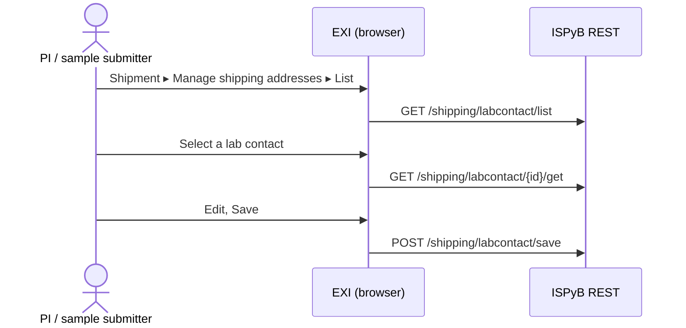

| # | User action | Route | View class | REST calls fired |
|---|---|---|---|---|
| 1 | Shipment ▸ Manage shipping addresses ▸ List | `#/proposal/addresses/nav` | `AddressListView` (nav) | `GET /shipping/labcontact/list` |
| 2 | Selects a lab contact | `#/proposal/address/{labcontactId}/main` | `AddressMainView` | `GET /shipping/labcontact/{id}/get` |
| 3 | Edits and saves | — | `AddressEditForm` | `POST /shipping/labcontact/save` |

**Note:** the "Add new" address entry point exists in source (`mainmenu.js:83-112`) but is
**commented out** in the menu — only reachable today via the "From"/"Return" dropdown's implicit
creation inside A2's shipment form, not as a standalone add flow.

---

## Persona B — Local Contact / Beamline Scientist

### B1 — Receive shipment, mark it at facility / to user

**Trigger:** shipment detail page, once it's marked "sent to DESY"
**Validation:** 📄 static-only — not independently re-tested. (Previously described as blocked by
an A6 "Send" button bug; that finding was retracted after a clean re-test — see A6 — so B1 is no
longer assumed blocked, it simply hasn't been walked live yet.)
**User guide:** [§Send the Shipment to DESY](user-guide.md#send-the-shipment-to-desy) (local-contact half)

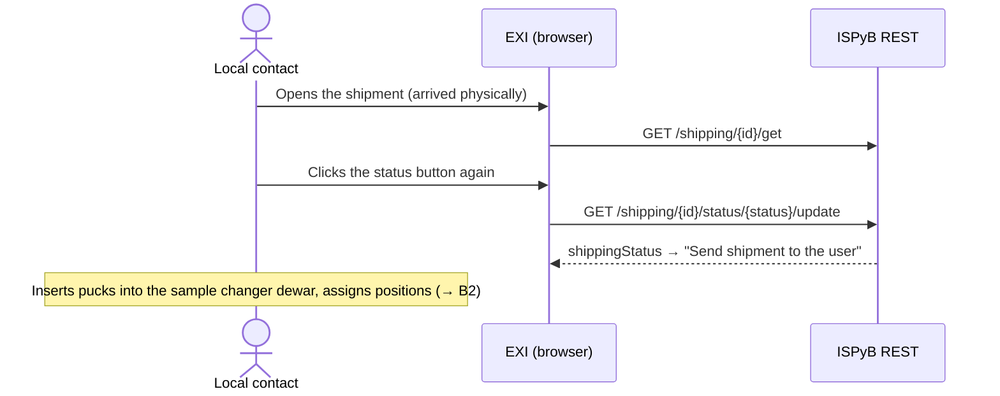

| # | User action | Route | View class | REST calls fired |
|---|---|---|---|---|
| 1 | Opens the shipment (arrived physically) | `#/shipping/{id}/main` | `ShippingMainView` | `GET /shipping/{id}/get` |
| 2 | Clicks the status button again | — | — | `GET /shipping/{id}/status/{status}/update` (→ "Send shipment to the user") |
| 3 | Inserts pucks into the sample changer dewar, assigns Unipuck sample-changer positions | → feeds into B2 | — | — |

---

### B2 — Prepare Experiment — load sample changer

**Trigger:** Prepare Experiment menu item
**Validation:** ⚠️ partial — steps 1–3 live-verified as `mgr01` with an active proposal; step 4
(drag-to-position on the Snap.svg) and step 5 (confirm/unload) not exercised

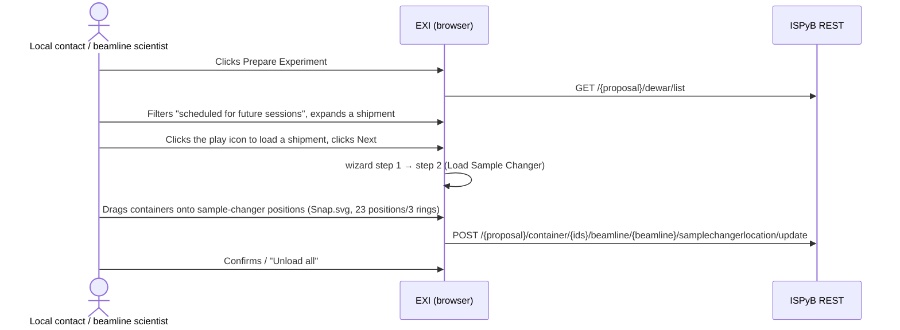

| # | User action | Route | View class | REST calls fired |
|---|---|---|---|---|
| 1 | Clicks Prepare Experiment | `#/mx/prepare/main` (step 1) | `PrepareMainView` | `GET /{proposal}/dewar/list` |
| 2 | Filters by "scheduled for future sessions", expands a shipment to see dewars/containers | — | `DewarListSelectorGrid` | — |
| 3 | Clicks the play icon to load a shipment, clicks Next | `#/mx/prepare/main/loadSampleChanger` (step 2) | `PrepareMainView` (`currentStep: 2`) | — |
| 4 | Assigns loaded containers to sample-changer positions on the P11 SVG (Snap.svg, 23 positions in 3 rings) | — | `LoadSampleChangerView` | `POST /{proposal}/container/{ids}/beamline/{beamline}/samplechangerlocation/update` |
| 5 | Confirms / "Unload all" | — | `ConfirmShipmentView` | status-update call (exact endpoint TBD live) |

**Route variant:** `#/mx/prepare/{dewarIds}/main` scopes the wizard to a specific comma-separated
dewar id list (deep link).

**Corrections found live:**
- Step 1 actually calls `GET /{proposal}/dewar/list` (`ProposalDataAdapter`/`DewarDataAdapter`'s
  `getDewarsByProposal`), **not** `GET /{proposal}/shipping/list` as originally assumed —
  `PrepareMainView.load()` (`preparemainview.js:246`) calls
  `proposal.dewar.getDewarsByProposal()` directly.
- Step 2's rendered page has a **UI text bug**: the shipment-count label reads
  `"1 shipments candidates for undefinedundefined"` — a literal `undefined` string
  concatenation, visible for any proposal.
- Step 3's wizard-step transition confirmed correctly: clicking Next moves the step indicator from
  "1 Select Shipment" to "2 Load Sample Changer", renders the "Loaded or to be Loaded on MxCube"
  table, "Unload all" button, and the "P11 (Sample changer)" SVG container, and the "Previous"
  button is present.

---

### B3 — Monitor a session's data collections, switch card tabs

Same mechanics as A7 steps 2–5, but reached as Persona B (no menu entry — always a drill-down from
Data Explorer or a direct URL) and validated against a session with real autoproc data.
**Trigger:** session row click, or direct navigation.
**Validation:** ✅ live-verified as `mgr01`

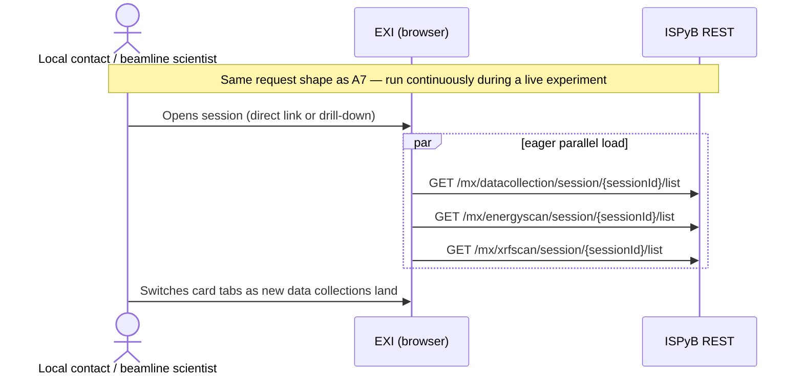

See A7's table — identical route/view/REST shape; this entry exists to make B3 a distinct index
row since it is the primary *beamline-side* journey, run continuously during an experiment, as
opposed to A7's post-hoc review.

**Live findings:** confirmed the 3 parallel list calls (`datacollection/session`, `energyscan/session`,
`xrfscan/session`) all fire for a richer session too. A number of `404`s were observed for
`mx/image/{id}/thumbnail`, `mx/datacollection/{id}/qualityindicatorplot`, and
`mx/datacollection/{id}/crystalsnaphot/1/get` — these are expected on a dev instance (the
underlying image/diffraction files referenced by the DB rows don't exist on disk there), not app
defects. One is worth a footnote: one thumbnail request resolved to
`mx/image/undefined/thumbnail` — the first-loaded DC's snapshot-image id was `undefined`, meriting
a look at whether that's a null-vs-undefined path issue.

---

### B4 — Drill into autoprocessing results, download attachments

**Trigger:** DC card's **"Last Collect Results"** tab (not "Workflow" — see A7 correction), or the
dedicated `#/autoprocintegration/datacollection/{dcId}/main` page
**Validation:** ⚠️ partial, but **the priority half — plot rendering — is now ✅ fully confirmed
with real data**. File download (step 4/5) remains explicitly out of scope: it's broken
client-side (see the confirmed bug), not merely untested, and the priority is plot rendering, not
file download.

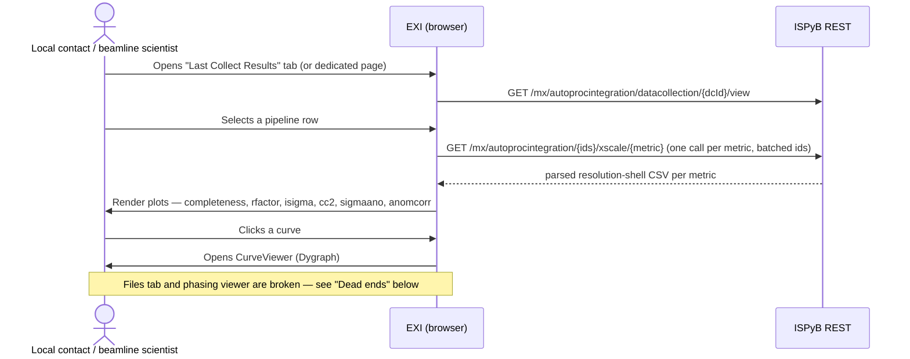

| # | User action | Route | View class | REST calls fired |
|---|---|---|---|---|
| 1 | From a DC's "Last Collect Results" tab (inline), or the dedicated page | `#/autoprocintegration/datacollection/{dcId}/main` | `AutoProcIntegrationMainView` + `AutoProcIntegrationListView` (nav) | inline tab: `GET /mx/autoprocintegration/datacollection/{dcId}/view`; dedicated page: same `.../view` call |
| 2 | Selects a pipeline row / page loads (XScale) | — | `AutoProcIntegrationGrid`, `AutoProcIntegrationPlots` | `GET /mx/autoprocintegration/{id1},{id2},…/xscale/{metric}` — **one call per metric, batched across every autoProcIntegrationId for the DC as a comma-joined list**, not per-row (confirmed: 6 metrics fire on row-select — `wilson` is not auto-requested by the plots panel) |
| 3 | Clicks a curve to open the interactive viewer | modal | `CurveViewer` (Dygraph) | not exercised |
| 4 | Clicks "Files" | `#/autoprocintegration/datacollection/{dcId}/files` | `AutoProcessingFileManager` | **BROKEN — see below, no request ever fires. Explicitly out of scope: plot rendering is the priority, not file download.** |
| 5 | Downloads an attachment | — | — | out of scope, see step 4 |
| 6 | Opens the phasing viewer for this DC | `#/autoprocintegration/datacollection/{dcId}/phasingviewer/main` | `PhasingViewerMainView` | **BROKEN — see below, no request ever fires** |

**✅ Plot rendering confirmed with real, non-mocked data.** The DB dump's attachment rows all
reference dead production paths, so every plot request 404'd against that data — not a code
defect, just no real files on a dev machine. To actually validate the rendering pipeline (not just
"a request fires"), an existing attachment row was pointed at a real, parser-format-correct
autoPROC log fixture (full recipe in `cypress/fixtures/mx/autoproc/README.md`). Result, confirmed
both via raw `fetch()` and by screenshotting the rendered UI:
- `completeness`, `rfactor`, `isigma`, `cc2`, `sigmaano`, `anomcorr` all returned real parsed CSV
  and **rendered as real line-chart curves** in the "Auto-Processing Plots" panel — Rfactor rising
  toward low resolution, Completeness flat near 100%, I/Sigma falling, CC/2 falling, SigAno
  roughly flat, Anom Corr noisy near zero — exactly the shapes real autoprocessing statistics
  should have. No console errors from the plot-rendering code itself.
- `wilson` is a separate, newly confirmed backend bug — see below.
- The "Attachments" side panel correctly lists the fixture-backed row alongside the still-dead
  production rows — that list is DB-only, no file I/O, so it was never affected by the missing
  files in the first place.
- Real recorded response bodies are saved as Cypress fixtures at `cypress/fixtures/mx/autoproc/`
  for use in `cy.intercept()`-based tests — see [Testing & Quality](testing.md).

**🐛 New confirmed bug (server-side) — `xscale/wilson` leaks a Java exception as a `200`
response.** Against the same real fixture, `GET .../xscale/wilson` returned `HTTP 200` with body
`Cannot invoke "java.lang.Double.doubleValue()" because "resolution" is null` — an uncaught NPE
serialized as if it were a successful response. Not client-visible in the default flow (the plots
panel doesn't auto-request `wilson`), but real and reproducible.

**Note:** a related route,
`#/autoprocintegration/datacollection/{dcId}/autoprocIntegration/{autoprocIntegrationId}/main`,
pre-selects one integration row but its `mainView.load` call is commented out in
`autoprocintegrationcontroller.js:81` — the main panel stays empty until the user re-selects. Flag
as a near-dead-end, not a full dead end.

**🐛 Confirmed bug — `#/autoprocintegration/datacollection/{dcId}/files` is completely broken.**
Console, verbatim:
```
ReferenceError: AutoProcessingFileManager is not defined
    at AutoprocIntegrationController.openFiles (exi.min.js:14562:13)
```
`AutoprocIntegrationController.prototype.openFiles` (`autoprocintegrationcontroller.js:14-18`)
constructs `new AutoProcessingFileManager()`, but that class is not defined anywhere reachable in
this build — the route throws immediately and no modal, no REST call, nothing renders. This
reproduces on every navigation to this route, regardless of dcId.

**🐛 Confirmed bug — the phasing viewer is completely broken, both entry points.** Console, verbatim:
```
ReferenceError: PhasingNetworkWidget is not defined
    at new PhasingViewerMainView (exi.min.js:12059:37)
```
`PhasingViewerMainView`'s constructor unconditionally instantiates `PhasingNetworkWidget`, which is
undefined — so **the view can never be constructed**, for any dcId. This breaks both B4 step 6
(`#/autoprocintegration/datacollection/{dcId}/phasingviewer/main`) and the standalone phasing
journey (`#/phasing/autoprocintegrationId/{id}/main`, `phasingcontroller.js:62`), which also
constructs `PhasingViewerMainView`. **The entire phasing feature is unreachable in this build,
independent of the empty `Phasing` DB table.**

---

### B5 — Inspect a workflow / characterisation step

**Trigger:** Workflow tab (per-card, when enabled) ▸ step selection
**Validation:** ⚠️ partial — **the primary route is confirmed broken**; the alternate route (row 3)
was not independently tested but reads correctly in source (see below)

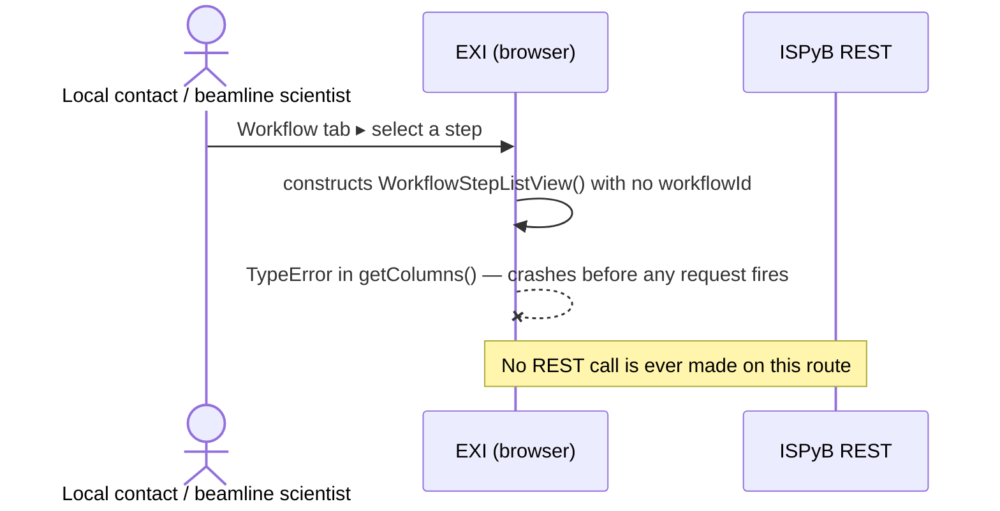

| # | User action | Route | View class | REST calls fired |
|---|---|---|---|---|
| 1 | From a DC's Workflow tab, selects a step | `#/mx/workflow/step/{workflowStepIdList}/main` | `WorkflowStepMainView` + `WorkflowStepListView` (nav) | **BROKEN — crashes before any request fires, see below** |
| 2 | Views step content — rendered per item type (image / table / logFile / images) | — | `WorkflowStepMainView` | `GET /mx/workflow/step/{id}/result`, and per-type: `GET /mx/workflow/step/{id}/image` or `/html`, `GET /mx/workflow/{id}/log` |
| 3 | Direct-select variant (auto-loads a named step) | `#/mx/workflow/{workflowId}/steps/{workflowStepIdList}/step/{workflowStepId}/main` | same | same, pre-loaded |

**🐛 Confirmed bug — the primary Workflow route (row 1) always crashes, for any workflowStepIdList.**
Console, verbatim:
```
TypeError: Cannot read properties of undefined (reading 'toString')
    at WorkflowDataAdapter.getWorkflowLogUrl (exi.min.js:6248:66)
    at WorkflowStepListView.getColumns (exi.min.js:15211:72)
```
Root cause, confirmed in source: `WorkflowController.prototype.init`
(`workflowcontroller.js:26-45`) constructs the primary route's nav list with
**`new WorkflowStepListView()`** — no argument. But `WorkflowStepListView(workflowId)`
(`js/mx/navigation/workflowsteplistview.js:1-2`) stores that argument as `this.workflowId`, and
`getColumns()` (line 27) unconditionally calls
`EXI.getDataAdapter().mx.workflow.getWorkflowLogUrl(this.workflowId)`, which does
`workflowId.toString()` — throwing on `undefined`. `EXI.addNavigationPanel(listView)` calls
`getPanel()` → `getColumns()` **synchronously**, before the `getWorkflowstepByIdList` REST call is
even issued, so the route dies before any network request and the nav panel never renders.

By contrast, the **second, alternate route**
(`#/mx/workflow/:workflowId/steps/:workflowStepIdList/step/:workflowStepId/main`,
`workflowcontroller.js:47-68`) correctly does `new WorkflowStepListView(workflowId)`, passing the
route's `:workflowId` param — that variant should work, but was not reachable from any menu or
observed UI element, and requires knowing a `(workflowId, workflowStepIdList, workflowStepId)`
triple with no discovered in-app link that supplies it.

**Practical impact:** since the primary route is how the (disabled-by-default) Workflow tab would
navigate if it were ever enabled for a DC, **B5 is unreachable through normal UI navigation in this
build** — a real, high-value finding for anyone auditing "what still works before the ExtJS 6
upgrade."

---

### B6 — Annotate a data collection with a comment

**Trigger:** comment icon on a DC card
**Validation:** 📄 static-only

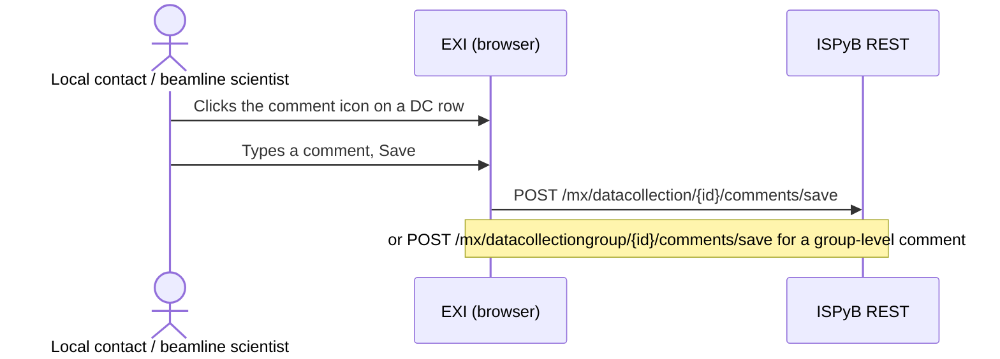

| # | User action | Route | View class | REST calls fired |
|---|---|---|---|---|
| 1 | Clicks the comment icon on a DC row | modal, no route | `CommentEditForm` | — |
| 2 | Types a comment, Save | — | — | `POST /mx/datacollection/{id}/comments/save` (or `POST /mx/datacollectiongroup/{id}/comments/save` for a group-level comment) |

---

## Persona C — Facility Manager

### C1 — Search sessions across all proposals by date

Identical mechanics to A1 steps 3–5, but the Manager's welcome page (`MXManagerMenu`) shows
sessions from every proposal, not just their own.
**Validation:** ✅ live-verified — confirmed via a Manager-role login, which lands on
`#/welcome/manager/{user}/main` and renders `MXManagerMenu` with the extra "Manager" top-level
item; the date-range picker mechanics are identical to A1's.

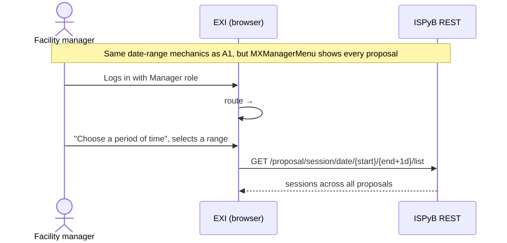

---

### C2 — Pull statistics as CSV

**Trigger:** Manager ▸ Statistics submenu (3 items)
**Validation:** ⚠️ partial — dialog open confirmed live; the actual "Plot"/CSV-download trigger was
not clicked

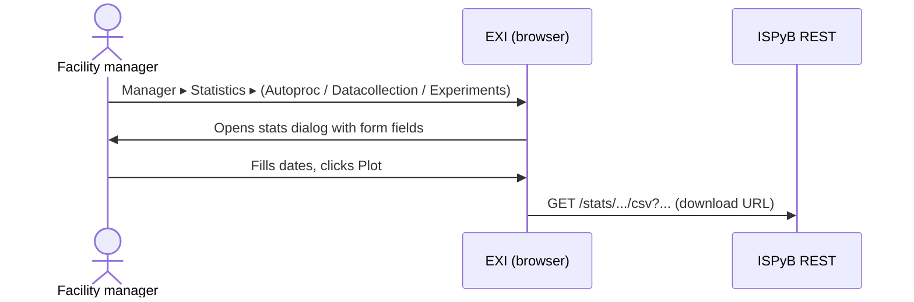

| # | User action | Route | View class | REST calls fired |
|---|---|---|---|---|
| 1 | Manager ▸ Statistics ▸ Autoproc Scaling Statistics | modal, no route | `ScatteringForm` | download URL: `GET /stats/autoprocstatistics/{type}/{start}/{end}/csv[?beamlinenames={bl}]` |
| 2 | Manager ▸ Statistics ▸ Datacollection Statistics | modal | `DatacollectionForm` | `GET /stats/datacollectionstatistics/{imageslimit}/{start}/{end}/{0-or-beamline}/csv?testproposals={bool}` |
| 3 | Manager ▸ Statistics ▸ Experiments Statistics | modal | `ExperimentsForm` | `GET /stats/experimentstatistics/{start}/{end}/{0-or-beamline}/csv?testproposals={bool}` |

**Live findings:** confirmed the "Manager" top-level menu exists only for the Manager-role
account, not the User-role one — a clean confirmation of the Persona C-only gating. The submenu
(like Shipment ▸ Shipments in A2) only reveals via a real hover, not a click. "Autoproc Scaling
Statistics" opened a dialog with form fields and a "Plot (last 7 days)" button/close, matching the
static description.

---

### C3 — Browse all sessions for one proposal

**Trigger:** linked from the DC view's proposal title (`datacollectionmxmainview.js:140`), or direct URL
**Validation:** 📄 static-only

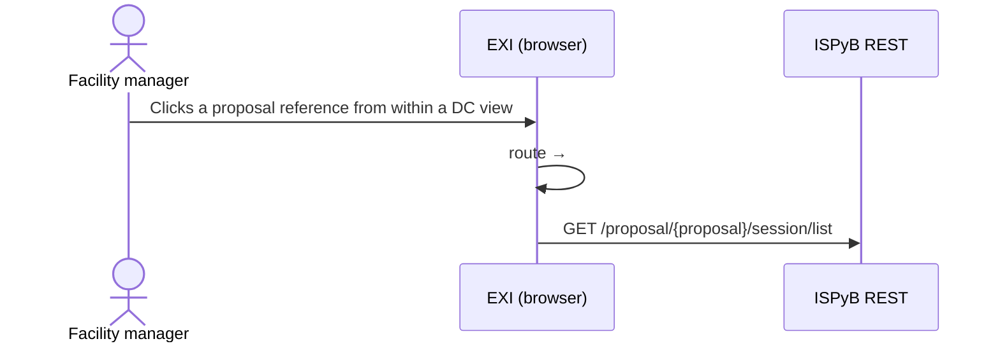

| # | User action | Route | View class | REST calls fired |
|---|---|---|---|---|
| 1 | Clicks a proposal reference from within a DC view | `#/welcome/manager/proposal/{proposal}/main` | `ManagerWelcomeMainView` | `GET /proposal/{proposal}/session/list` (or equivalent proposal-scoped session list) |

---

## Cross-cutting journeys

### X1 — Switch active proposal mid-session

**Validation:** 📄 static-only. The credential splitbutton (top-right) lists each
`{proposal}@{username}` combination the user is authorized for; selecting one calls
`EXI.credentialManager.setActiveProposal(username, proposal)`. All subsequent `{proposal}`
placeholders in adapter URLs use the new value; views constructed before the switch are not
retroactively refreshed — switching proposal without also navigating leaves a stale view showing
the old proposal's data.

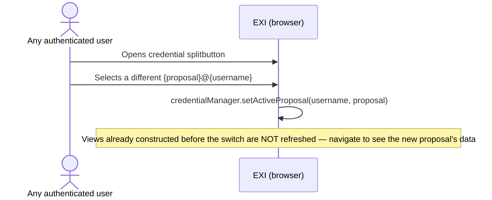

### X2 — Deep link into a specific DC/session/shipment pre-auth

**Validation:** 📄 static-only. Four "redirector" routes exist purely to handle a deep link before
authentication/proposal-switch has happened, then re-dispatch to the real route:
`#/mx/proposal/{proposal}/datacollection/session/{sessionId}/main` (`mxdatacollectioncontroller.js:88`),
plus siblings for `sample`, `shipping`, and `dcid`. Each authenticates/switches proposal, then
forwards to the corresponding non-prefixed route (A7/B3/B4 etc).

```mermaid
sequenceDiagram
    actor U as Any user (pre-auth deep link)
    participant EXI as EXI (browser)
    participant API as ISPyB REST
    U->>EXI: Opens deep link (session/sample/shipping/dcid + proposal prefix)
    EXI->>EXI: authenticate / switch active proposal
    EXI->>EXI: re-dispatch to the corresponding non-prefixed route
    EXI->>API: (same calls as the target journey — e.g. A7/B3/B4)
```

### X3 — Log out

**Validation:** ⚠️ partial — the logout *side effect* was confirmed live (accidentally), not the
splitbutton UI path itself.

**🔑 Live finding, important for anyone else testing this app:** navigating to **`#/welcome`
logs the user out**, not just `#/logout`. `js/core/controller/exicontroller.js` registers
`#/welcome` with the same handler as `#/login` — "Logs out, shows the login window." This was
discovered when using `#/welcome` as a harmless-seeming intermediate hash to force a route
re-dispatch (Path.js doesn't re-fire on an unchanged hash) — it silently cleared
`credentialManager`'s state and returned to the auth form. **Anyone scripting this app (Cypress,
Playwright, or otherwise) must never hash-navigate through `#/welcome` as a no-op waypoint** — use
a neutral in-app route instead (e.g. `#/protein/list`) if a hash-change detour is needed.

```mermaid
sequenceDiagram
    actor U as Any authenticated user
    participant EXI as EXI (browser)
    U->>EXI: Sign In/Log out splitbutton ▸ Log out
    EXI->>EXI: clear credentialManager state
    EXI->>U: show login form
    Note over EXI: #/welcome (not just #/logout) also triggers this — a trap for anyone scripting the app
```

### X4 — Failed login

**Validation:** ✅ live-verified (pre-existing) — fully covered by `cypress/e2e/auth/login.cy.js`.
Included here only for completeness of the journey index; no new work needed.

```mermaid
sequenceDiagram
    actor U as Any user
    participant EXI as EXI (browser)
    participant API as ISPyB REST
    U->>EXI: Fills wrong credentials, Login
    EXI->>API: POST /authenticate?site=LOCAL
    API-->>EXI: 401
    EXI->>U: "Your credentials are invalid" (Ext.Msg)
    Note over EXI: Does not navigate away
```

---

## Dead ends and broken journeys

### Confirmed broken via live console errors

These reproduce every time, independent of data — genuine code defects, not "no test data" gaps:

```mermaid
flowchart LR
    classDef broken fill:#fdecea,stroke:#b3261e,color:#1c1b19
    classDef ok fill:#e8f5e9,stroke:#2d6a44,color:#1c1b19

    Puck["#/puck/nav, #/mx/puck/... (all Puck routes)"]:::broken
    Files["autoprocintegration/.../files (B4)"]:::broken
    Phasing["phasingviewer/main, /phasing/... (B4)"]:::broken
    Workflow["mx/workflow/step/:ids/main — primary route (B5)"]:::broken
    WorkflowAlt["mx/workflow/:workflowId/steps/.../main — alt route"]:::ok
    AutoprocMain["autoprocintegration/datacollection/:dcId/main"]:::ok

    AutoprocMain -->|"Files tab"| Files
    AutoprocMain -->|"phasing viewer link"| Phasing
    Workflow -.->|"correct args, but no in-app entry point"| WorkflowAlt
```

| Route(s) | Symptom (verbatim console error) | Root cause |
|---|---|---|
| `#/mx/puck/{containerId}/main`, `#/mx/puck/add`, `#/puck/nav`, `#/puck/{containerId}/main` | `ReferenceError: PuckWelcomeMainView is not defined` (confirmed live at `#/puck/nav`) | `PuckMainView` / `PuckWelcomeMainView` referenced by `puckcontroller.js` and `proposalexicontroller.js:61` but **defined nowhere in `js/`** |
| `#/autoprocintegration/datacollection/{dcId}/files` | `ReferenceError: AutoProcessingFileManager is not defined` | Class not defined anywhere reachable in this build; `AutoprocIntegrationController.prototype.openFiles` throws immediately. Breaks B4 step 4. |
| `#/autoprocintegration/datacollection/{dcId}/phasingviewer/main` **and** `#/phasing/autoprocintegrationId/{id}/main` | `ReferenceError: PhasingNetworkWidget is not defined` | `PhasingViewerMainView`'s constructor unconditionally instantiates the undefined class — **the entire phasing feature is unreachable**, for any id, independent of the empty `Phasing` DB table. Breaks B4 step 6. |
| `#/mx/workflow/step/{workflowStepIdList}/main` (the **primary**, menu/tab-reachable Workflow route) | `TypeError: Cannot read properties of undefined (reading 'toString')` at `WorkflowDataAdapter.getWorkflowLogUrl` | `WorkflowController` constructs `new WorkflowStepListView()` with no `workflowId` argument; `getColumns()` dereferences it unconditionally. Crashes before any REST call fires — see B5. The sibling route `#/mx/workflow/:workflowId/steps/.../main` passes the argument correctly and should work, but has no discovered in-app entry point. |

### Confirmed working despite wrong internal call arguments (not dead ends)

The server tolerated all of these; the user-visible journey completes. Listed here because a
stricter server implementation could break them, and because they indicate a systemic pattern
(adapter calls receiving the wrong id for `shippingId`/`dewarId` positions) worth a dedicated
audit:

| Call site | What should fire | What actually fires |
|---|---|---|
| `a_puckformview.js:73` (`getContainerById`, puck load — A5 step 5) | `.../shipping/{shippingId}/dewar/{dewarId}/puck/{containerId}/get` | `.../shipping/{containerId}/dewar/{containerId}/puck/{containerId}/get` |
| Same view's Save (`saveContainer`, A5 step 8) | `.../shipping/{shippingId}/dewar/{dewarId}/puck/{containerId}/save` | `.../shipping/{containerId}/dewar/{containerId}/puck/{containerId}/save` |
| `parcelpanel.js:108` (`getDewarLabelURL`, A6 step 1) | `.../shipping/{shippingId}/dewar/{dewarId}/labels` | `.../shipping/{dewarId}/dewar/{dewarId}/labels` |

### Retracted finding

A6/B1's "Send Shipment" button was originally reported as functionally dead despite correct
server-side state. **Retracted after a clean re-test confirmed the button works correctly** —
kept as a one-line record so this catalogue's revision history is traceable rather than silently
rewritten. The likely explanation was stale in-tab state from earlier prototype monkey-patching in
the same browser tab, not a real app defect — a lesson that single behavioral observations from a
tab that's had test-harness internals patched into it need a clean-session re-check before being
written up as confirmed.

### Still static-only

Route/menu-table analysis; not independently reproduced live:

| Route(s) | Symptom | Root cause |
|---|---|---|
| `#/experiment/nav` | Falls through to the no-op `Path.rescue` | Handler exists at `mainmenu.js:318-320` but the route is never registered in the MX app (only SAXS registers `#/experiment/...` patterns) |
| `#/proposal/shipping/nav?nomain` | Never matches a real navigation | Registered with a literal `?nomain` in the pattern string (`shippingexicontroller.js:75`); `location.hash` would need to contain that exact query string |
| `#/{proposalId}/datacollection/session/{sessionId}/main` (EM) vs `#/mx/datacollection/session/{sessionId}/main` (MX) | Currently harmless, but fragile | EM's 5-segment wildcard (`emdatacollectioncontroller.js:54`) structurally matches the same input as the main MX session route. It loses today only because `MxDataCollectionController` is constructed before `EMDataCollectionController` in `js/mx/eximx.js`. Reordering that array — or adding an EM controller earlier — would silently break the primary MX journey (A7/B3), which **is** live-verified working today. |
| `#/autoprocintegration/datacollection/{dcId}/autoprocIntegration/{autoprocIntegrationId}/main` | Main panel stays empty until manual re-selection | `mainView.load` call commented out (`autoprocintegrationcontroller.js:81`) |
| `#/phasing/autoprocintegrationId/{id}/nav` | Not reachable | Commented out (`phasingcontroller.js:98`) |
| `#/mx/prepare/main/selectSampleChanger` | Not reachable | Commented out (`mxprepare.js:33`) |
| `#/mx/image/{imageId}/main` | Not reachable | Entirely commented out in `imagecontroller.js:25-30`; only the DC-scoped variant `#/mx/datacollection/{dcId}/image/{imageId}/main` works |
| Energy Scan / XFE (`#/mx/xfe/{id}/main`) | Route/view code not exercised with real data | `EnergyScan`, `XFEFluorescenceSpectrum` tables are empty in the current DB; the disabled-tab *rendering* (confirmed via `x-tab-disabled`) is the only part live-verified |
| Ligands (`#/ligands/list`) | Likely empty | `Ligand` table does not exist in this DB at all; not navigated to live |

---

## Shipment lifecycle

A view of the same shipping status machine that threads through A2, A4–A6, and B1, drawn as one
state diagram instead of scattered across four journeys:

```mermaid
stateDiagram-v2
    [*] --> opened: A2 shipment created
    opened --> opened: A4 / A5 add parcels, containers, samples
    opened --> labelPrinted: A6 print labels (per dewar)
    labelPrinted --> sentToDESY: A6 "Send notification of shipping to facility"
    sentToDESY --> atFacility: B1 local contact marks arrival
    atFacility --> processing: B2 pucks loaded into sample changer
    processing --> sentToUser: B1 "Send shipment to the user"
    sentToUser --> [*]: dewar returned
    note right of processing
        Shipment contents can no longer
        be changed once status is "processing"
    end note
```

---

For how these journeys map onto the automated Cypress suite — what's covered, what isn't, and
why — see [Testing & Quality](testing.md).
