# EXI User Guide

EXI can be used in creating a shipment. Creating a shipment in EXI with a complete list of Unipucks and samples can also be synched to MXCuBE and connection sample information and associated data.

* [Logging to EXI](#logging-to-EXI)
* [Create a shipment](#create-a-shipment)
* [Edit Shipment and Creating a Lab Contact](#edit-shipment-creating-a-lab-contact)
* [Create new Samples and Provide a Sample List](#Create-new-samples-and-provide-a-sample-list)
    * [Adding New Protein and Creating New Sample](#adding-new-protein-and-creating-new-sample)
    * [Fill Sample Information in a CSV File](#fill-sample-information-in-a-CSV-file)
    * [Fill Sample Information Online](#fill-sample-information-online)
* [Send the Shipment to DESY](#send-the-shipment-to-DESY)
* [Arrange the Return of Dewars](#arrange-the-return-of-dewars)

## Logging to EXI

Users with a scheduled beamtime at the facility can log in to EXI at any time so create a shipment.

* Log in with your DOOR account credentials.
* Click on **"Sessions"** menu item.
* Click on **"Choose a period of time"** and select a time slot with your beamtime, if you can't see your proposal in the table.
* Select the proposal you want to work with. Make sure you work with the proposal with scheduled beamtime. Sample information entered under the wrong proposal cannot be accessed during the experiment.

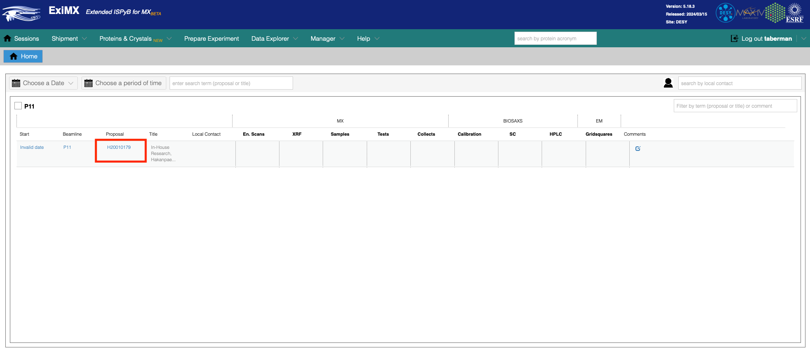

## Create a Shipment
The next steps are to generate the ID and shipping labels for your dewars, list the containers and samples in the dewars and send a notification to the facility staff. Even if you plan to transport the dewars to the facility yourself, creating the shipment is useful to provide the required sample information to be used in synching to MXCuBE.

* From the **"Shipment"** dropdown menu, select **"Shipments"** and **"Add new"**.
  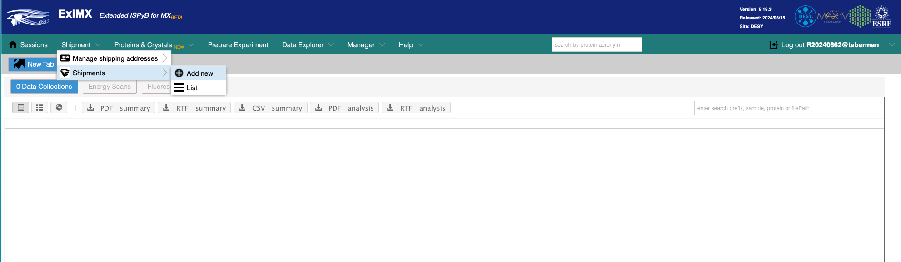
* Fill in the shipment form. This information will be shown in the two ID labels generated by EXI to easily identify your dewar when it arrives and departs the facility and while it is present at the beamline. *Note:* Even if you are using your own shipping labels, or bringing the dewar to the facility yourself, it is important to attach the ID label to the dewar to avoid misidentification.
    * The **Name** field entry will appear in the shipment list and the ID labels and it must be unique for the proposal. We recommend a name containing the date of the experiment.
    * The **Session** menu allows selection between the beamtimes associated with selected proposal and needs to be chosen.
    * Select from the **From** drop down menu your name or other contact person in your home lab responsible for the shipment.
    * Usually the **Return address** will be the *“Same as for shipping to the beamline”* (default), but you may choose a different one.
    * Save the entered information.
 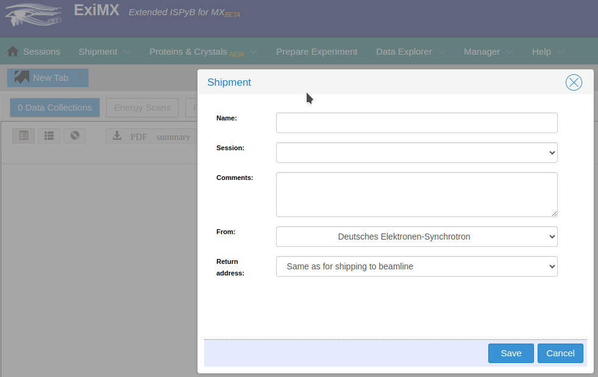

## Edit Shipment and Creating a Lab Contact
If you wish to review or edit the information after saving the form, select **List** under **Shipments** in the **Shipment** dropdown menu. 
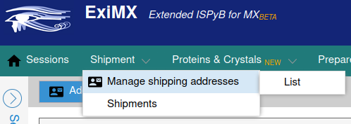
That will show a list of your shipments in the left side of the window in inverse order of creation (you might need to refresh the page to show the newly created shipment). Click anywhere on the shipment card to open the shipment information.
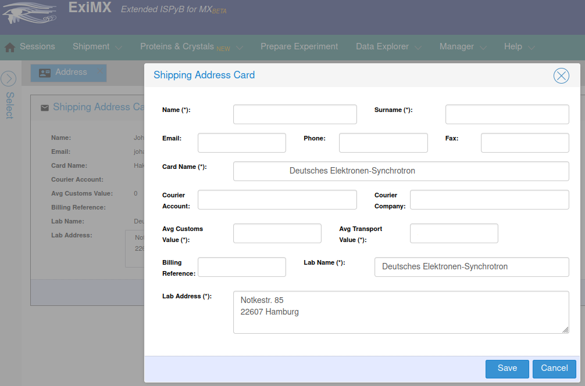

## Create New Samples and Provide a Sample List
This section describes how to enter information about the parcels, containers and samples present in the shipment. Adding the parcels must be done in order to generate the shipping label for the dewars, as described in the [Send the Shipment to DESY](#send-the-shipment-to-DESY). However, filling up the sample details can be done while the dewars are in transit or even when they are already at the facility. Once the Unipucks are loaded in the sample changer dewar (shipment status set to “processing”) it will not be possible to change the shipment contents any longer.

### Adding New Protein and Creating New Sample
If you are sending crystals of a new protein, it is important that you create an entry for the protein, since you will not be able to upload or save information from an unknown sample. To create a protein follow these steps:
* Click on **Proteins and Crystals** in the upper menu bar.
* Select **Add new protein**.
* You can also display the **List** to check is the protein is already present.
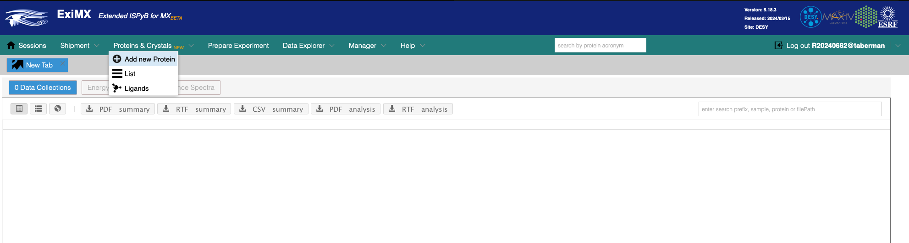

Enter the *Protein Name* and *Acronym* in the dialog box and click **Save**.

If you wish to enter and save the space group and unit cell, look for the protein in the **List** and click on the *Crystal form* tab at the right of the card. This information is not compulsory and can also be added at a later stage for each crystal in the sample information list.

### Fill Sample Information in a CSV File
To add containers and sample information go back to your shipment by selecting **List** in the **Shipment** dropdown menu. That will show a list of your shipments in the left side of the window in inverse order of creation (you might need to refresh the page to show the newly created shipment). Click anywhere on the shipment card to open the shipment information.

A practical way to enter information about the parcels, containers and samples included in the shipment is by uploading a CSV file.
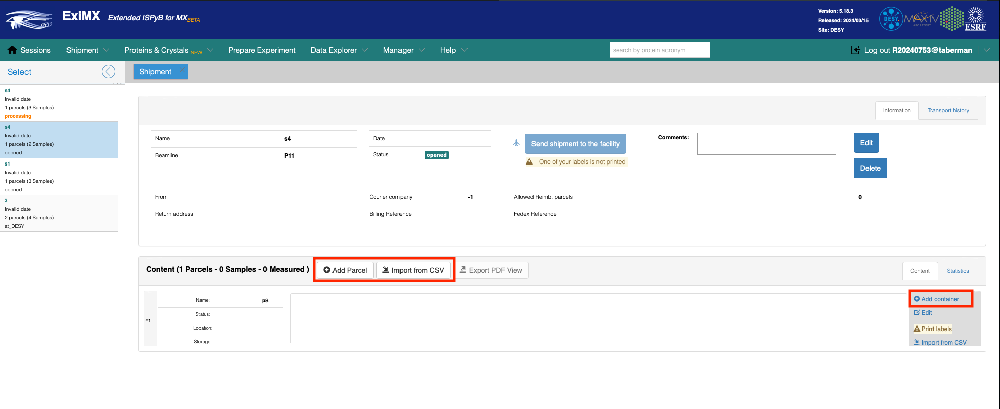

The upload menu is accessed by clicking the *Import from CSV* button in the shipment card. The example [Shipment.csv](https://github.com/scientific-software-hub/mxhub-exi/blob/main/documentation/Shipment.csv) file will generate a parcel called Dewar1 containing seven Unipucks fully loaded with crystals of different proteins.

After saving the sample list, you can edit the information by going to the shipment page, clicking on the containers and selecting **Edit**. That will display the sample list for that container. 

You can also make corrections to the CSV file, then delete the parcel by clicking on the **“Edit”** icon to the right of the parcel pane and clicking on **Remove**, and finally reload the corrected CSV again.

You can now find the filled up parcel in the shipment page. Use the icons to the right to add extra Unipucks, edit/remove the parcel, print the shipping labels. To import a CSV file, use the link above the parcel pane.

### Fill Sample Information Online
To add containers and sample information go to your shipment by selecting **List** in the **Shipment** dropdown menu. That will show a list of your shipments in the left side of the window in inverse order of creation (you might need to refresh the page to show the newly created shipment). Click anywhere on the shipment card to open the shipment information.
Click the *Add parcel* button.
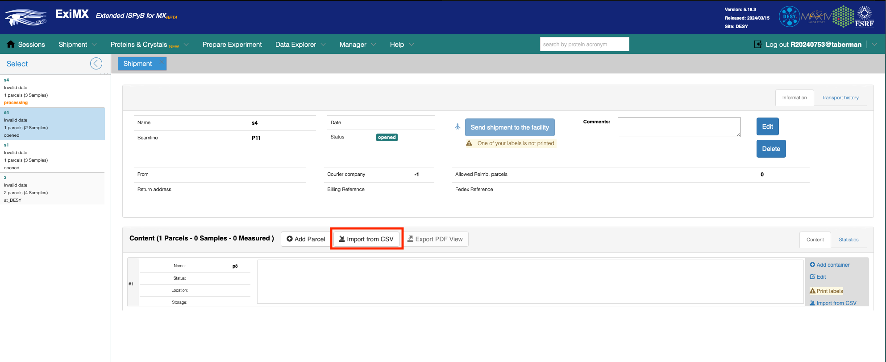

In the dialog box fill up the *Parcel Name* (must be unique within the shipment) and select the type (usually *“dry shipper”*). Then, click **Save**.

Back at the shipment page, click on the *Add container* link to the right of the new parcel card.

Enter the *Name* of the container. This must be the name engraved in the Unipuck, and it must be unique within the shipment. Then select Unipuck as the type (this is the only type of container supported at P11 in DESY). When you save, an image of the Unipuck will be displayed in the parcel card.
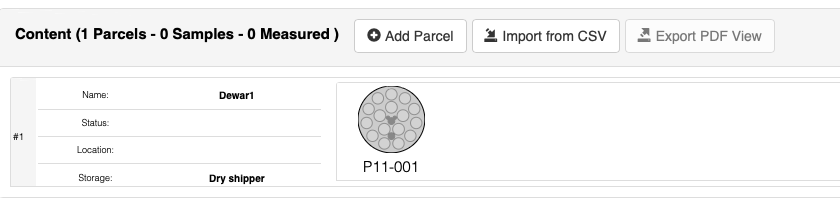

Click on the Unipuck and select **Edit**. This will direct to the spreadsheet form where you can list the samples in the container.
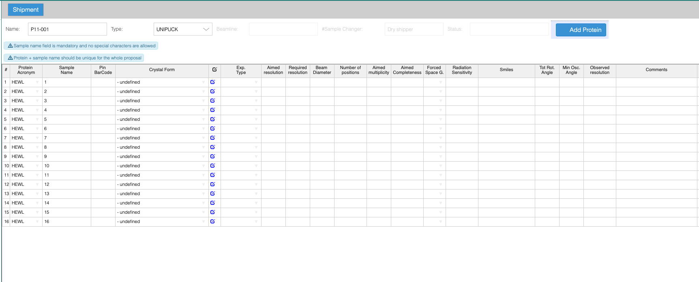

In the table:
* Select the protein from the drop down menu. If it is not there, create a new sample as either from the **Proteins and Crystals** menu as described above or by clicking on the **Add Protein** button in the container sample list spreadsheet form. Refresh the page to show the newly created protein.
* Enter a sample name. It must be unique for each sample of each protein.
* After filling up the sample information, click on **Shipment** button above the spreadsheet and reply *Yes* to save the changes to the container or click on **Save**
 button.
 
## Send the Shipment to DESY
Click on the *Print labels* icon to the right of each parcel to generate a PDF-file with the shipping and return EXI labels. *Make sure that the information on the labels is correct*. If not, go to the “Shipping addresses” list and correct the information.
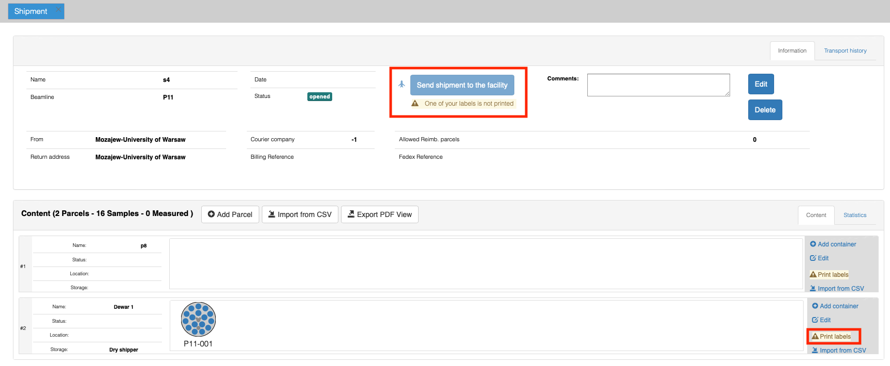

If everything is correct, print the labels. Please, attach the dewar label and the shipping label on your dewars, and enclose the return label within the dewar box with other return forms (courier waybill or invoice).

If you are sending to and from **outside EU** and need customs declarations:
* You need to fill in a Proforma invoice to send along with the shipment.
* Be sure to use a proper description of the content of the shipment, as an example: “Dry shipper containing small frozen protein crystals for scientific experiments. Crystals are non-hazardous. Dewar contains non-flammable gas (liquid N2).”

The button *Send Shipment* to the facility will be activated once you print the labels (you need to refresh the page for this). When you click it, the status of the dewar will change to *“Mark shipment at facility”*. This will let beamline staff know that the shipment is on its way.

When the dewar arrives at DESY, staff will click the button again and the shipment status will be set to *“Send shipment to the user”* to wait for the return transport.

You will be able to modify the shipment in EXI after shipping the dewars until your pucks are inserted in the sample changer dewar.

After your dewar has arrived to DESY and it is the time for your experiment the local contact will insert the pucks in the sample changer dewar and assign the actual Unipuck position in to the Prepare experiment tab for synching the information to MXCuBE.

## Arrange the Return of Dewars

You are responsible for organizing the courier for the transport of both incoming and departing dewars.
* Please be prepared to order the return shipment before the beamtime, and be sure to attach the return papers from your courier to the dewar in addition to the EXI-generated shipping labels
* If the courier will not supply you with a return waybill at the moment you ship the dewar, please send an email to beamline manager to arrange this after your beamtime and to send the labels from your courier.
    
After the data collection is done, local users should do the following:
* Attach the return address papers from your courier and the paper from EXI to the dewar(s).
* Put the dewar in the designated area outside the beamline (“Dewar departure point”).
    
Please be aware that **you need to order the courier yourself** and please check that the return address is complete.

Inform the expected pick-up date and time at least a day in advance.

If you are sending to and from **outside EU** please enclose the Proforma invoice.

---
This documentation is written with the support of Helena Taberman.

