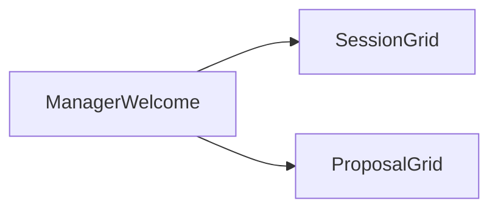
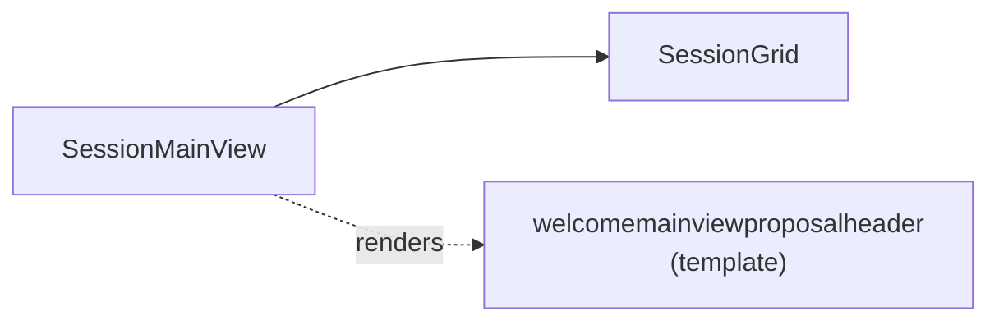
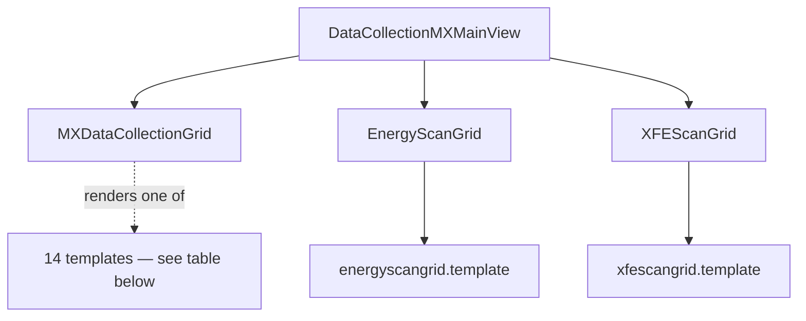
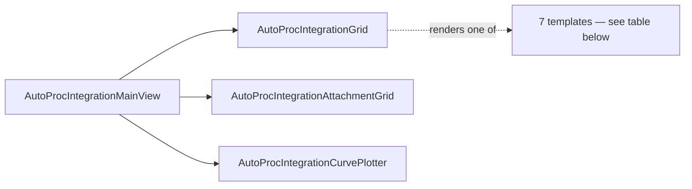
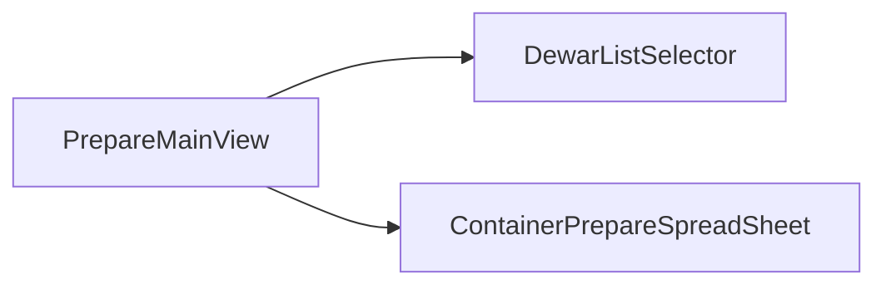

# Widget & Template Tree

Where [MX Module Architecture](architecture.md) shows how controllers route to top-level views
and which REST endpoints each view fires, this page drills one level deeper: how each of those
views assembles its ExtJS **widgets**, and which precompiled **Dust** templates those widgets
render. Templates are precompiled by Grunt's `dustjs` task into
`min/precompiled.templates.min.js` — see the [Developer Guide](developer-guide.md#tech-stack).

---

## Manager Welcome

---

## Session Main View

---

## Data Collection MX Main View

The deepest tree in the app. `MXDataCollectionGrid` alone renders through 14 Dust templates
depending on view mode (uncollapsed / collapsed / containers) and which per-card section is
showing.

**`MXDataCollectionGrid` templates:**

| Template | Used for |
|---|---|
| `mxdatacollectiongrid.template` | grid root |
| `general.mxdatacollectiongrid.template` | general/summary section |
| `first.general.mxdatacollectiongrid.template` | general section, first-row variant |
| `second.general.mxdatacollectiongrid.template` | general section, second-row variant |
| `beamline.mxdatacollectiongrid.template` | beamline parameters section |
| `detector.mxdatacollectiongrid.template` | detector parameters section |
| `diffraction.mxdatacollectiongrid.template` | diffraction/run parameters section |
| `ids.mxdatacollectiongrid.template` | internal id block |
| `collapsed.mxdatacollectiongrid.template` | collapsed (summary) card view |
| `autoproc.mxdatacollectiongrid.template` | autoprocessing status summary |
| `completeness.autoproc.mxdatacollectiongrid.template` | autoproc completeness indicator |
| `unitcell.autoproc.mxdatacollectiongrid.template` | autoproc unit-cell readout |
| `sm.completeness.autoproc.mxdatacollectiongrid.template` | completeness indicator, small/compact variant |
| `datacollections.mxdatacollectiongrid.template` | per-run "Data Collections" tab contents |

---

## AutoProcIntegrationMainView

**`AutoProcIntegrationGrid` templates:**

| Template | Used for |
|---|---|
| `autoprocintegrationgrid.template` | grid root |
| `unitcell.autoprocintegrationgrid.template` | unit-cell readout |
| `statistics.autoprocintegrationgrid.template` | scaling statistics table |
| `phasing.autoprocintegrationgrid.template` | phasing summary |
| `files.autoprocintegrationgrid.template` | attachment/file listing |
| `plots.autoprocintegrationgrid.template` | XScale/FastDP plot panel |
| `unitcell.screening.mxdatacollectiongrid.template` | unit-cell readout, screening-run variant |

---

## PrepareMainView

---

## WorkflowMainView

No widgets or templates are recorded for this view in the source tree — flagged here as a
documentation gap rather than silently dropped. See
[Workflow — Widget Hierarchy & Endpoints](architecture.md#8-workflow-widget-hierarchy-endpoints)
in the architecture doc for what's known about its routing and endpoints instead.
